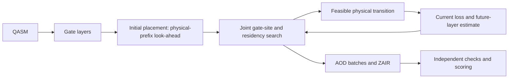

<div align="center">

# GA-LK

**Genetic search and look-ahead for zoned neutral-atom quantum compilation**

[](scripts/requirements-current-source.txt)
[](ZAC_zzx/native/)
[](IEEE_conference_template/figures/)

[Quick start](#quick-start) · [Method](#how-it-works) · [Results](#current-manuscript-results) · [Reproduction](#three-reproduction-levels) · [Paper](#manuscript)

</div>

GA-LK combines **genetic search** with **look-ahead evaluation** to compile
quantum circuits for architectures with separate storage and entanglement zones.
Look-ahead first selects the initial atom placement. As the circuit advances,
genetic search coordinates gate sites, inter-layer residency and return storage
sites using current and future execution costs. The output is an executable
ZAIR instruction stream checked by a separate physical verifier.

This repository contains current source, editable manuscript and processed
research evidence. **Running the current source is not the same as reproducing
historical paper runs**, whose native binaries and protocols are separately
identified in the evidence manifests.

### Project snapshot · September 2026

| Component | Status |
|---|---|
| Chinese manuscript | Nine-page, red-marked review draft; editable TeX and vector figures included |
| Initialization and horizon studies | Scheduled quality runs finished; complete comparisons and failed outcomes retained |
| Current-source demo | Fresh-environment build and 14-qubit compilation verified on macOS arm64 |
| Evidence | Current manuscript tables and original accepted results are separately versioned |
| English / Overleaf | English alignment is paused; the Overleaf mirror is synchronized separately |

This `main` branch is the only maintained project. Generated output and local
history stay outside Git; see the [repository map](docs/REPOSITORY_MAP.md).

## Quick start

Use CPython **3.10–3.12**, CMake **3.20+**, a C++17 compiler and network access
to the Python package index. TeX and QMAP are not needed for the GA-LK demo.
Run from the repository root:

```bash
python3 scripts/portable_reproduce.py bootstrap --name runtime-v1
python3 scripts/portable_reproduce.py smoke --runtime runtime-v1 --name smoke-v1
python3 scripts/portable_reproduce.py audit-artifacts
```

Bootstrap creates a **new isolated environment**, installs the declared direct
dependencies, builds the current extension and verifies its installed bytes
against the wheel. It never changes an existing environment. The smoke compiles
the bundled toy circuit, verifies actual ZAIR constraints and per-qubit gate
ordering, and independently scores the physical trace.

All generated output stays under `IEEE_conference_template/build/portable/`:

| Output | Contents |
|---|---|
| `runtime-v1/bootstrap.json` | Source digests, native identity and provenance |
| `runtime-v1/current_config.json` | Public example bound to the new wheel |
| `runtime-v1/resolved-packages.txt` | Complete resolved package set |
| `smoke-v1/smoke.json` | Effective initializer, physical checks and model score |
| `smoke-v1/trace.json` | Complete executable ZAIR |
| `smoke-v1/compiler.log` | Diagnostic compiler output |

Run names are immutable; choose a new name for another attempt. A passing
smoke is **not a performance claim or a reproduction of the paper tables**.
See the [clean-export procedure](docs/REPRODUCIBILITY.md#clean-source-export)
to test without the author's ignored source trees, environments or raw runs.

## How it works



The public [GA-LK configuration](ZAC_zzx/exp_setting/ga_lk_default.json) uses
`physical_prefix` initialization: `H_init=2`, up to four candidates including
the simulated-annealing layout, decay `0.7` and 32 evaluations per rollout
layer. Layer-boundary optimization uses bounded genetic search, bounded
return-site assignment and decayed future-layer evaluation; small decision
spaces are enumerated.

For the simulated-annealing initialization control, set `"init_strategy": "legacy"`
and remove `initial_lookahead` in a **copy** of the generated configuration.
The layer-boundary look-ahead remains independent. Frozen ABI8 and explicit
historical configurations retain their recorded behavior.

## Current manuscript results

The Chinese review draft uses the completed
[initialization-look-ahead result bundle](ZAC_zzx/results/default_initial_v1/paper_exports/)
for its abstract, overall comparison, representative circuits and Fig. 7(a).
The quality study contains 507 canonical circuit/seed jobs: 484 successes,
four independently verified recovered results and 19 failed outcomes, with
no pending jobs. The [outcome summary](ZAC_zzx/results/default_initial_v1/quality_summary.json)
retains all of them.

| Suite | Common circuit units | Compared with | Fidelity gain | MOVE-batch reduction |
|---|---:|---|---:|---:|
| ZAC18 | 16 | Reuse-aware ZAC | 8.90% | 19.19% |
| ZAC18 | 16 | Routing-aware placement | 11.45% | 9.89% |
| QMAP154 | 120 | Reuse-aware ZAC | 26.24% | 25.85% |
| QMAP154 | 120 | Routing-aware placement | 26.11% | 25.20% |

Values come from [the generated summary](ZAC_zzx/results/default_initial_v1/paper_exports/default_initial_values.json):
fidelity is a geometric mean and MOVE batches an arithmetic mean, with both
baselines evaluated on the same eligible circuit set. QMAP aliases are combined
into independent circuit units. These are aggregate model-based quality results,
not per-circuit guarantees or compiler speedups. Compilation time is reported
separately in the manuscript and is higher than the baselines.

| Evidence | What it supports |
|---|---|
| [Current main rows](ZAC_zzx/results/default_initial_v1/paper_exports/main_rows.csv) and [analysis units](ZAC_zzx/results/default_initial_v1/paper_exports/analysis_units.csv) | Overall and per-circuit quality comparisons |
| [Initialization control](ZAC_zzx/results/initial_lookahead_v1/) | First-layer versus multi-layer initialization; 36 complete circuit comparisons |
| [Horizon study](ZAC_zzx/results/horizon_extension_v2/combined_quality_summary.json) | Layer-look-ahead comparison; 10 complete circuit comparisons across five settings |
| [Original accepted package](ZAC_zzx/results/paper_zh_v2/) | Preserved original results, controlled search/look-ahead comparisons and serial timing |

The original package is unchanged. Controlled ablations retain their own
settings and populations; overall configuration gains are not attributed to
initialization alone. Unsuccessful refinement candidates remain diagnostic
records and are not incorporated into GA-LK.

## Three reproduction levels

| Task | Entry point | Meaning of a pass |
|---|---|---|
| Run current source | `bootstrap` + `smoke` | Working fresh toolchain, current defaults and valid toy trace |
| Audit distributed historical results | `audit-artifacts` | Size/SHA-256 agreement of 14 processed files with the accepted manifest |
| Recompute historical experiments | Frozen protocols plus their declared input/runtime closure | Requires corresponding canonical inputs, binaries and baseline dependencies; not supplied by the toy workflow |

The original accepted package is [paper_zh_v2](ZAC_zzx/results/paper_zh_v2/).
It retains the earlier GA-LK configuration and the two baseline results on
ZAC18 and QMAP154. The newer manuscript bundle above is separate: the original
workbook below is **not** a workbook of the updated initialization study.
GA-NL in that workbook is an independent configuration, not the shared-parameter
H=0 ablation. No study rewrites the earlier acceptance manifest.

- [Two-sheet workbook](ZAC_zzx/results/paper_zh_v2/four_methods_results.xlsx): complete circuit rows and timing breakdowns.
- [Final manifest](ZAC_zzx/results/paper_zh_v2/final_manifest.json): processed-file hashes and provenance.
- [Analysis units](ZAC_zzx/results/paper_zh_v2/main_primary_analysis_units.csv): exact independent circuit units.
- [Original summary](ZAC_zzx/results/paper_zh_v2/main_summary.json): original aggregate and paired statistics.

The [code/data inventory](docs/DATA_AND_CODE.md) records formats, units, access
and unresolved release requirements. Hashes identify evidence; they do not
replace distributing it.

The [benchmark acquisition guide](docs/REPRODUCIBILITY.md#obtain-and-normalize-the-exact-inputs)
provides 172 original/canonical input hashes, official-source acquisition and
normalization checks. A separate preparation command creates the current-default
suite configuration; it does not pretend to reproduce historical baseline runs.

## Manuscript

The active Chinese source is
[paper_zh.tex](IEEE_conference_template/paper_zh.tex). Figures are editable
TikZ/PGFPlots; the overall framework is built separately as a vector PDF.

- **Source-only rendering:** see the [bundled rendering procedure](docs/REPRODUCIBILITY.md#render-the-bundled-paper). This is a layout build, not a revalidation of historical experiments.
- **Author's strict audit:** `make paper` and `make paper-test` retain their full evidence requirements, including local frozen dependencies. They are not unconditional fresh-clone quick-start commands.

English files are a **pending translation snapshot**, not a verified translation
of the latest Chinese revision. The desktop copy is also a retained snapshot;
edit only the in-repository manuscript. Overleaf is a manuscript mirror, not
the compiler-code remote.

## Repository map

| Path | Responsibility |
|---|---|
| [ZAC_zzx/zzx](ZAC_zzx/zzx/) | Python integration, placement and physical state |
| [ZAC_zzx/native](ZAC_zzx/native/) | C++17 search and candidate evaluation |
| [ZAC_zzx/evaluation](ZAC_zzx/evaluation/) | Trace normalization, independent checks and scoring |
| [ZAC_zzx/experiments_v2](ZAC_zzx/experiments_v2/) | Canonicalization, protocols and provenance |
| [ZAC_zzx/results](ZAC_zzx/results/) | Current manuscript bundle, preserved accepted package and compact study evidence |
| [ZAC](ZAC/) | Upstream ZAC source and BSD-3-Clause notice |
| [IEEE_conference_template](IEEE_conference_template/) | Manuscript, figures and presentation checks |
| [scripts](scripts/) / [docs](docs/) | Portable entry points and documentation |
| `IEEE_conference_template/build/` | Generated environments, wheels, traces, PDFs and QA; ignored |
| `archive/`, `fidelity-lookahead-v2/` | Local history and frozen raw dependencies; not in portable exports |

See the [maintenance map](docs/REPOSITORY_MAP.md) for historical path recovery
and Overleaf synchronization. This repository's `main` is the source of truth.

## Troubleshooting and release status

- **Missing compiler/CMake:** install platform development tools first; bootstrap never installs system packages.
- **Wheel/ABI mismatch:** create a new runtime and use its generated configuration. Never bypass a historical wheel pin.
- **Download failure:** inspect `install-dependencies.log`; use a new name after fixing package-index access.
- **Source changed after building:** rebuild under a new name; do not combine edited Python with an old native extension.
- **Strict paper checks lack raw evidence:** obtain the declared closure, or use source-only rendering without a scientific-QA claim.

Direct dependencies are pinned; complete resolved packages and platform details
are recorded per build. Cross-platform bitwise equivalence is not assumed.
See the [validation record](docs/PORTABLE_VALIDATION.md) for the tested platform,
clean-export smoke, source-only paper build and remaining release gaps.

Retain upstream [ZAC/LICENSE](ZAC/LICENSE). A license for newly authored code
and research data awaits the author's decision. Third-party PDFs are excluded
from portable exports; see [rights and availability](docs/DATA_AND_CODE.md#rights-and-release-decisions).

Cite the [repository](https://github.com/zhouzixiang1/zac-ga) with an exact commit
and relevant evidence manifest. No release DOI or publication identifier is
asserted before one exists.
