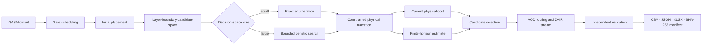

<div align="center">

# ZAC-GA

**Fidelity-aware layer-boundary compilation for zoned neutral-atom architectures**

[](ZAC_zzx/experiments_v2/environment_zac_qiskit124.lock.txt)
[](ZAC_zzx/native/CMakeLists.txt)
[](ZAC_zzx/experiments_v2/README.md)
[](ZAC_zzx/results/paper_zh_v2/final_manifest.json)

[Overview](#overview) · [Method](#method-at-a-glance) · [Repository map](#repository-map) · [Results](#paper-result-snapshot) · [Build and test](#build-and-test) · [Reproducibility](#reproducibility-boundaries)

</div>

> [!NOTE]
> The paper-facing implementation and verified artifacts live on the
> `codex/fidelity-lookahead-v2` branch. The repository is currently private;
> access and anonymization should be configured for the relevant review stage.

## Overview

ZAC-GA studies compilation for **zoned neutral-atom quantum architectures**,
where atoms move between storage and entanglement zones under constrained AOD
control. At each two-qubit layer boundary, the compiler must balance atom
transfer, idle Rydberg excitation, coherence loss, and the routing consequences
of the resulting physical state.

The main method, **GA-LK**, jointly chooses two-qubit gate sites, cross-layer
residency, and storage locations. Every complete candidate is subjected to the
same physical state-transition checks before it is ranked by its current
physical cost and a decayed finite-horizon estimate. Small decision spaces are
enumerated exactly; larger spaces use a bounded genetic search.

The paper evaluates four compiler configurations:

| Configuration | Role | Layer-boundary objective |
|---|---|---|
| **ZAC** | Baseline from Lin *et al.* | Adjacent-layer reuse and partner-aware matching |
| **ICCAD/QMAP** | Routing-aware A* baseline from Stade *et al.* | Compatible movement groups and routing cost |
| **GA-NL** | No-layer-lookahead ablation | Joint placement with the current physical cost only |
| **GA-LK** | Full method | Joint placement with decayed finite-horizon evaluation |

## Method at a glance



The implementation keeps candidate generation, physical feasibility, and
future-state evaluation separate from the independent trace validator. This
separation prevents a compiler decision from being accepted solely because it
passes its own internal bookkeeping.

## Repository map

| Path | Purpose |
|---|---|
| [`ZAC_zzx/native/`](ZAC_zzx/native/) | C++17 layer-boundary search backend and native tests |
| [`ZAC_zzx/zzx/`](ZAC_zzx/zzx/) | Python compiler integration, state handling, and routing logic |
| [`ZAC_zzx/experiments_v2/`](ZAC_zzx/experiments_v2/) | Schema-v2 experiment drivers, statistics, export, and provenance checks |
| [`ZAC_zzx/exp_setting/native_ga_v1/`](ZAC_zzx/exp_setting/native_ga_v1/) | Frozen experiment configurations and circuit splits |
| [`ZAC_zzx/results/native_ga_v1/`](ZAC_zzx/results/native_ga_v1/) | Four-method delivery for ZAC18 and QMAP154 |
| [`ZAC_zzx/results/paper_zh_v2/`](ZAC_zzx/results/paper_zh_v2/) | Current paper aggregates, independent analysis units, workbook QA, and final evidence manifest |
| [`ZAC_zzx/results/paper_zh_v1/`](ZAC_zzx/results/paper_zh_v1/) | Preserved historical aggregate; not overwritten by the v2 statistics update |
| [`ZAC/`](ZAC/) | Original ZAC baseline and its environment |
| [`documents/`](documents/) | Local copies of the baseline papers used by this study |

## Paper result snapshot

The primary comparison requires valid ZAC, ICCAD/QMAP A*, and GA-LK results;
GA-NL is an internal configuration and does not determine this cohort. QMAP
aliases with the same canonical QASM hash are averaged before inference, while
compiler coverage continues to count every frozen input file.

| Evidence | ZAC18 | QMAP154 |
|---|---:|---:|
| Valid files in the primary cohort | 18 | 122 |
| Independent analysis units | 18 circuit files | 120 canonical-hash clusters |
| Fidelity geometric-mean ratio | 1.0795 | 1.2478 |
| Independent-unit bootstrap 95% confidence interval | [1.0024, 1.2198] | [1.0461, 1.5865] |
| Median ratio per independent unit | 1.0052 | 0.9976 |
| Win / tie / loss | 12 / 0 / 6 | 49 / 0 / 71 |

These aggregates require different interpretations. ZAC18 gains include one
additional valid circuit that was previously excluded only because GA-NL was
incomplete. On QMAP154, the positive geometric mean is driven by a small upper
tail; the median and win/loss counts do not indicate an improvement on most
independent units. GA-LK also requires substantially more compilation time than
either baseline.

Authoritative artifacts:

- [`final_manifest.json`](ZAC_zzx/results/paper_zh_v2/final_manifest.json) - file hashes and evidence protocol;
- [`main_primary_analysis_units.csv`](ZAC_zzx/results/paper_zh_v2/main_primary_analysis_units.csv) - exact circuit or canonical-cluster means used by bootstrap and Wilcoxon;
- [`four_methods_results.xlsx`](ZAC_zzx/results/paper_zh_v2/four_methods_results.xlsx) - complete file-level ZAC18 and QMAP154 tables;
- [`main_summary.json`](ZAC_zzx/results/paper_zh_v2/main_summary.json) - primary and internal-configuration statistics;
- [`paper_workbook_qa/`](ZAC_zzx/results/paper_zh_v2/paper_workbook_qa/) - workbook structure, formula scan, and rendered previews.

## Build and test

### Native backend

```bash
cd ZAC_zzx/native
python -m pip install build
python -m build --wheel -o dist
python -m pip install --force-reinstall dist/zac_native-*.whl

cmake -S . -B build/ctest -DBUILD_TESTING=ON
cmake --build build/ctest --config Release
ctest --test-dir build/ctest --output-on-failure
```

### Paper-facing regression checks

Run from `ZAC_zzx/` in an environment containing the ZAC and experiment
dependencies:

```bash
python -m pytest -q -p no:cacheprovider \
  tests/test_final_results.py \
  tests/test_cli_v2.py \
  tests/test_native_resident_integration.py \
  tests/test_native_rich_solver.py \
  tests/test_resident_rent_guard.py \
  tests/test_qmap_legacy_regression.py
```

See [`ZAC_zzx/native/README.md`](ZAC_zzx/native/README.md) for the native ABI
contract and [`ZAC_zzx/experiments_v2/README.md`](ZAC_zzx/experiments_v2/README.md)
for the experiment protocol.

## Reproducibility boundaries

- Main quality and timing results are bound to the frozen **ABI8** build;
  ablation and sensitivity tracks use the frozen **ABI9** build. Their wheel
  hashes and validation records are separated in the final manifest.
- The paper evaluates only **ZAC18** and **QMAP154**. QASMBench and large-circuit
  pilot runs are not part of the manuscript evidence.
- MQT QMAP 3.2 is an external dependency and is not vendored as a complete
  standalone build in this repository.
- Some experiment-plan provenance records retain machine-specific paths. The
  checked-in manifests support artifact auditing, but a fresh clone is not yet
  a one-command reproduction of every raw run.
- No repository-level license has been selected. The code should be treated as
  research software with all rights reserved until a license is added.

## Baselines and attribution

This work builds on the zoned architecture and reuse-aware compilation model in
ZAC, and on routing-aware placement in MQT QMAP. The corresponding local paper
copies are available under [`documents/`](documents/). Please cite the original
works when using their methods or reported results.

## Repository reference

When referring to the implementation, use the repository URL together with an
exact commit hash:

```text
https://github.com/zhouzixiang1/zac-ga
```

Publication metadata and a formal citation file will be added when the
manuscript record is finalized.
