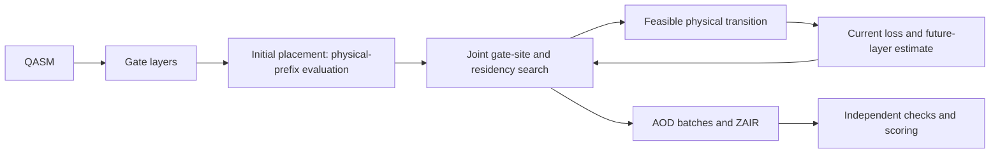

<div align="center">

# GA-LK

**Genetic search and look-ahead for zoned neutral-atom quantum compilation**

[](scripts/requirements-current-source.txt)
[](ZAC_zzx/native/)
[](IEEE_conference_template/figures/)

[Quick start](#quick-start) · [Method](#how-it-works) · [Results](#current-manuscript-results) · [Reproduction](#three-reproduction-levels) · [Paper](#manuscript)

</div>

GA-LK combines **genetic search** with **look-ahead evaluation** to compile
quantum circuits for architectures with separate storage and entanglement zones.
In the manuscript configuration, physical-prefix genetic search selects the
initial atom placement. As the circuit advances,
genetic search coordinates gate sites, inter-layer residency and return storage
sites using current and future execution costs. The output is an executable
ZAIR instruction stream checked by a separate physical verifier.

This repository contains current source, editable manuscript and processed
research evidence. **Running the current source is not the same as reproducing
historical paper runs**, whose native binaries and protocols are separately
identified in the evidence manifests.

### Project snapshot · September 2026

| Component | Status |
|---|---|
| Manuscripts | Aligned, anonymous Chinese and English clean drafts; English six body pages plus one reference page, Chinese six pages |
| Initialization and horizon studies | Scheduled quality runs finished; complete comparisons and failed outcomes retained |
| Current-source demo | Isolated bootstrap, toy compilation and independent ZAIR checks; dated platform validation recorded separately |
| Evidence | Current physical-GA main results, controlled studies and original accepted results are separately versioned |
| Overleaf | Manuscript-only mirror; the 2026-09-20 synchronization was verified at `5cd7151` |

This `main` branch is the only maintained project. Generated output and local
history stay outside Git; see the [repository map](docs/REPOSITORY_MAP.md).

## Quick start

Use CPython **3.10–3.12**, CMake **3.20+**, a C++17 compiler and network access
to the Python package index. TeX and QMAP are not needed for the GA-LK demo.
Run from the repository root:

```bash
python3 scripts/portable_reproduce.py bootstrap --name runtime-v1
python3 scripts/portable_reproduce.py smoke --runtime runtime-v1 --name smoke-v1
python3 scripts/portable_reproduce.py audit-artifacts
```

Bootstrap creates a **new isolated environment**, installs the declared direct
dependencies, builds the current extension and verifies its installed bytes
against the wheel. It never changes an existing environment. The smoke compiles
the bundled toy circuit, verifies actual ZAIR constraints and per-qubit gate
ordering, and independently scores the physical trace.

All generated output stays under `IEEE_conference_template/build/portable/`:

| Output | Contents |
|---|---|
| `runtime-v1/bootstrap.json` | Source digests, native identity and provenance |
| `runtime-v1/current_config.json` | Public example bound to the new wheel |
| `runtime-v1/resolved-packages.txt` | Complete resolved package set |
| `smoke-v1/smoke.json` | Effective initializer, physical checks and model score |
| `smoke-v1/trace.json` | Complete executable ZAIR |
| `smoke-v1/compiler.log` | Diagnostic compiler output |

Run names are immutable; choose a new name for another attempt. A passing
smoke is **not a performance claim or a reproduction of the paper tables**.
See the [clean-export procedure](docs/REPRODUCIBILITY.md#clean-source-export)
to test without the author's ignored source trees, environments or raw runs.

## How it works


```mermaid
flowchart LR
    A[QASM] --> B[Gate layers]
    B --> C[Initial placement: physical-prefix evaluation]
    C --> D[Joint gate-site and residency search]
    D --> E[Feasible physical transition]
    E --> F[Current loss and future-layer estimate]
    F --> D
    D --> G[AOD batches and ZAIR]
    G --> H[Independent checks and scoring]
```

The [public example](ZAC_zzx/exp_setting/ga_lk_default.json) and current
standard GA-LK parser default still use `physical_prefix`: the original
simulated-annealing layout and a pool of up to four candidates are compared
with `H_init=2`, decay `0.7` and 32 inner encoding evaluations per rollout
layer. Layer-boundary optimization uses genetic search, bounded return-site
assignment and decayed future-layer evaluation; small decision spaces are
enumerated.

The **current manuscript uses the explicit `physical_prefix_ga` strategy**.
It searches atom-to-storage-site permutations with population 8, two elites,
OX crossover probability 0.25, at most 32 unique mapping evaluations and six
generations. Fitness evaluates the first layer and the next two with decay
0.7, inner look-ahead disabled and an inner budget of 32. Subsequent dynamic
optimization uses H=8. The outer mapping and inner encoding budgets are
separate; this opt-in strategy has not silently changed the source default.

To select it in a **copy** of a generated current-runtime configuration, set
`init_strategy` to `physical_prefix_ga` and `init_engine` to `ga`, remove
`initial_lookahead`, `init_pop` and `init_gens`, and supply `initial_ga` controls
(or use the defaults in
[PhysicalInitialGAConfig](ZAC_zzx/zzx/physical_initial_ga.py)). This runs the
current implementation; an exact historical replay also requires the frozen
[main-study protocol](ZAC_zzx/results/physical_ga_main_v1/protocol.json).
For the earlier SA control, set `init_strategy` to `legacy`, keep
`init_engine=sa`, and remove initializer-specific look-ahead controls.
Frozen ABI8 and explicit historical configurations retain their recorded behavior.

## Current manuscript results

Both manuscripts use the independent
[physical-GA main-result bundle](ZAC_zzx/results/physical_ga_main_v1/paper_exports/)
for the abstract and overall comparison. Its 507 canonical circuit/seed jobs
cover 169 distinct inputs under 172 file labels and seeds 0, 1 and 2. There
are 480 successful compilations, 18 timeouts, six program errors and three
memory-limit outcomes. Of the successful compilations, 64 have fidelity
outside the model's validity domain and remain separately recorded. The
[study record](ZAC_zzx/results/physical_ga_main_v1/README.md) explains the 27
prespecified pilot jobs reused in this matrix and the 480 fresh jobs.

| Suite | Common circuit units | Compared with | Fidelity gain | MOVE-batch reduction |
|---|---:|---|---:|---:|
| ZAC18 | 16 | Reuse-aware ZAC | 5.95% | 15.69% |
| ZAC18 | 16 | Routing-aware placement | 8.43% | 5.99% |
| MQT QMAP examples | 119 | Reuse-aware ZAC | 26.42% | 25.86% |
| MQT QMAP examples | 119 | Routing-aware placement | 26.28% | 25.22% |

Values come from [the generated summary](ZAC_zzx/results/physical_ga_main_v1/paper_exports/ga_main_values.json).
The study first takes each field's three-seed median per input file and then
combines aliases of eligible canonical circuits. Fidelity is a geometric mean;
MOVE batches and physical latency use arithmetic means. Both baselines use
the same comparison set. The internal identifier `qmap154` refers to the 154
MQT QMAP example files, not to a separately published dataset name.
These are aggregate model-based quality results, not per-circuit guarantees or
compiler speedups. In particular, the QMAP aggregate against ZAC comprises
48 improved and 71 lower-fidelity circuit units. Timing has its own populations
and scheduling conditions.

| Evidence | What it supports |
|---|---|
| [Current main rows](ZAC_zzx/results/physical_ga_main_v1/paper_exports/main_rows.csv), [analysis units](ZAC_zzx/results/physical_ga_main_v1/paper_exports/analysis_units.csv) and [provenance](ZAC_zzx/results/physical_ga_main_v1/paper_exports/provenance.json) | Current overall and per-circuit quality comparisons, physical components and all recorded outcomes |
| [Physical-GA initialization pilot](ZAC_zzx/results/physical_ga_initial_v1/corrected_driver_v1/) | Four initialization strategies, 108 jobs and eight complete paired circuit comparisons |
| [Horizon study](ZAC_zzx/results/horizon_extension_v2/combined_quality_summary.json) | Layer-look-ahead comparison; ten complete circuit comparisons across five settings |
| [Previous main-result bundle](ZAC_zzx/results/default_initial_v1/paper_exports/) and [earlier initialization control](ZAC_zzx/results/initial_lookahead_v1/) | Preserved SA-plus-candidate study and prior controlled initialization results |
| [Original accepted package](ZAC_zzx/results/paper_zh_v2/) | Preserved original results, controlled search/look-ahead comparisons and serial timing |

Earlier packages remain unchanged. Controlled ablations retain their own
settings and populations; overall configuration gains are not attributed to
initialization alone. The current and previous main studies also have different
eligible cohorts, so their aggregate difference is not an initialization-only
effect. Failed and diagnostic outcomes remain part of their study records.

## Three reproduction levels

| Task | Entry point | Meaning of a pass |
|---|---|---|
| Run current source | `bootstrap` + `smoke` | Working fresh toolchain, current defaults and valid toy trace |
| Audit distributed historical results | `audit-artifacts` | Size/SHA-256 agreement of 14 processed files with the accepted manifest |
| Recompute historical experiments | Frozen protocols plus their declared input/runtime closure | Requires corresponding canonical inputs, binaries and baseline dependencies; not supplied by the toy workflow |

The original accepted package is [paper_zh_v2](ZAC_zzx/results/paper_zh_v2/).
It retains the earlier GA-LK configuration and the two baseline results on
ZAC18 and QMAP154. The current physical-GA manuscript bundle and the previous
`default_initial_v1` bundle are separate: the original workbook below is **not**
a workbook of either
updated initialization study.
GA-NL in that workbook is an independent configuration, not the shared-parameter
H=0 ablation. No study rewrites the earlier acceptance manifest.

- [Two-sheet workbook](ZAC_zzx/results/paper_zh_v2/four_methods_results.xlsx): complete circuit rows and timing breakdowns.
- [Final manifest](ZAC_zzx/results/paper_zh_v2/final_manifest.json): processed-file hashes and provenance.
- [Analysis units](ZAC_zzx/results/paper_zh_v2/main_primary_analysis_units.csv): exact independent circuit units.
- [Original summary](ZAC_zzx/results/paper_zh_v2/main_summary.json): original aggregate and paired statistics.

The [code/data inventory](docs/DATA_AND_CODE.md) records formats, units, access
and unresolved release requirements. Hashes identify evidence; they do not
replace distributing it.

The [benchmark acquisition guide](docs/REPRODUCIBILITY.md#obtain-and-normalize-the-exact-inputs)
provides 172 original/canonical input hashes, official-source acquisition and
normalization checks. A separate preparation command creates the current-default
suite configuration; it does not pretend to reproduce historical baseline runs.

## Manuscript

The active sources are [paper_zh.tex](IEEE_conference_template/paper_zh.tex) and
[paper_en.tex](IEEE_conference_template/paper_en.tex). Their claims, formulas,
citations and data are aligned. Both use clean text and anonymous author fields;
the personal repository footnote was removed from the manuscript. Figures are
editable TikZ/PGFPlots; the framework is built independently for each language
before the paper. The current layout has four figures, one table and one algorithm.

- **Source-only rendering:** see the [bundled rendering procedure](docs/REPRODUCIBILITY.md#render-the-bundled-paper). This is a layout build, not a revalidation of historical experiments.
- **Author's strict audit:** `make paper` and `make paper-test` retain their full evidence requirements, including local frozen dependencies. They are not unconditional fresh-clone quick-start commands.

Use `make paper-en` for the English build and shared Chinese checks. Build
products belong in `IEEE_conference_template/build/`; generators and tests are
in [scripts/paper/](scripts/paper/), while writing records, provenance and retired
figures are in [docs/paper/](docs/paper/README_zh.md). Edit only the in-repository
manuscripts; desktop copies and ZIPs are retained snapshots. Overleaf is a
manuscript mirror, not the compiler-code remote. Its last recorded verification
is documented in the [2026-09-20 audit](docs/paper/notes/20260920_reference_anonymity_audit.md).

## Repository map

| Path | Responsibility |
|---|---|
| [ZAC_zzx/zzx](ZAC_zzx/zzx/) | Python integration, placement and physical state |
| [ZAC_zzx/native](ZAC_zzx/native/) | C++17 search and candidate evaluation |
| [ZAC_zzx/evaluation](ZAC_zzx/evaluation/) | Trace normalization, independent checks and scoring |
| [ZAC_zzx/experiments_v2](ZAC_zzx/experiments_v2/) | Canonicalization, protocols and provenance |
| [ZAC_zzx/results](ZAC_zzx/results/) | Current manuscript bundle, preserved accepted package and compact study evidence |
| [ZAC](ZAC/) | Upstream ZAC source and BSD-3-Clause notice |
| [IEEE_conference_template](IEEE_conference_template/) | Minimal bilingual manuscript source and required figure/data inputs |
| [scripts/paper](scripts/paper/) / [docs/paper](docs/paper/) | Paper generators, checks and tests / writing records, metadata and retired material |
| [scripts](scripts/) / [docs](docs/) | Portable entry points and documentation |
| `IEEE_conference_template/build/` | Generated environments, wheels, traces, PDFs and QA; ignored |
| `archive/`, `fidelity-lookahead-v2/` | Local history and frozen raw dependencies; not in portable exports |

See the [maintenance map](docs/REPOSITORY_MAP.md) for historical path recovery
and Overleaf synchronization. This repository's `main` is the source of truth.

## Troubleshooting and release status

- **Missing compiler/CMake:** install platform development tools first; bootstrap never installs system packages.
- **Wheel/ABI mismatch:** create a new runtime and use its generated configuration. Never bypass a historical wheel pin.
- **Download failure:** inspect `install-dependencies.log`; use a new name after fixing package-index access.
- **Source changed after building:** rebuild under a new name; do not combine edited Python with an old native extension.
- **Strict paper checks lack raw evidence:** obtain the declared closure, or use source-only rendering without a scientific-QA claim.

Direct dependencies are pinned; complete resolved packages and platform details
are recorded per build. Cross-platform bitwise equivalence is not assumed.
See the [validation record](docs/PORTABLE_VALIDATION.md) for the tested platform,
clean-export smoke, source-only paper build and remaining release gaps.

Retain upstream [ZAC/LICENSE](ZAC/LICENSE). A license for newly authored code
and research data awaits the author's decision. Third-party PDFs are excluded
from portable exports; see [rights and availability](docs/DATA_AND_CODE.md#rights-and-release-decisions).

Cite the [repository](https://github.com/zhouzixiang1/zac-ga) with an exact commit
and relevant evidence manifest. No release DOI or publication identifier is
asserted before one exists.
