# 2025_iccad_routing-aware_placement_zoned_neutral_atom

<!-- page 1 -->

Routing-Aware Placement
for Zoned Neutral Atom-based Quantum Computing

Yannick Stade∗, Wan-Hsuan Lin§, Jason Cong§, and Robert Wille∗†‡

∗Chair for Design Automation, Technical University of Munich, Munich, Germany

†Munich Quantum Software Company GmbH, Garching near Munich, Germany

‡Software Competence Center Hagenberg GmbH, Hagenberg, Austria
§Computer Science Department, University of California, Los Angeles, USA
yannick.stade@tum.de, wanhsuanlin@ucla.edu, cong@cs.ucla.edu, robert.wille@tum.de

www.cda.cit.tum.de/research/quantum

qubits [5]–[8], ion traps [9]–[12], etc. In contrast, the software
support for zoned neutral atom architectures [4], [13] remains
rather limited.

Abstract—Quantum computing promises to solve previously
intractable problems, with neutral atoms emerging as a promising
technology. Zoned neutral atom architectures allow for immense
parallelism and higher coherence times by shielding idling atoms
from interference with laser beams. However, in addition to
hardware, successful quantum computation requires sophisticated
software support, particularly compilers that optimize quantum
algorithms for hardware execution. In the compilation flow for
zoned neutral atom architectures, the effective interplay of the
placement and routing stages decides the overhead caused by
rearranging the atoms during the quantum computation. Sub-
optimal placements can lead to unnecessary serialization of the
rearrangements in the subsequent routing stage. Despite this, all
existing compilers treat placement and routing independently thus
far—focusing solely on minimizing travel distances. This work
introduces the first routing-aware placement method to address
this shortcoming. It groups compatible movements into parallel
rearrangement steps to minimize both rearrangement steps and
travel distances. The implementation utilizing the A* algorithm
reduces the rearrangement time by 17% on average and by 49%
in the best case compared to the state-of-the-art. The complete
code is publicly available in open-source as part of the Munich
Quantum Toolkit (MQT) at https://github.com/cda-tum/mqt-qmap.

More precisely, the compilation is separated into several
stages—with placement and routing being particularly impor-
tant as part of the layout synthesis. Their interplay decides
how efficiently the atoms are rearranged during the quantum
computation. Obviously, the placement affects the subsequent
routing: A bad placement leads to bad routing. Unfortunately,
all available compilers handle the placement and routing
as two completely independent stages and purely focus on
minimizing atoms’ travel distance—leaving substantial room
for improvement (as motivated in more detail later in Sec. III).

This work addresses this problem by proposing the first
routing-aware placement method for zoned neutral atom
architectures to facilitate efficient routing. This method groups
compatible movements that can be executed in parallel into
rearrangement steps. The objective of routing-aware placement
is to minimize not only the travel distances of the atoms but also
the number of rearrangement steps. Given the vast search space
of possible placements, sophisticated exploration methods are
essential. Therefore, we propose a solution based on the A*
algorithm [14], complemented by a dedicated data structure
for efficient and accurate cost anticipation.

Index Terms—quantum computing, compiler, neutral atoms,
zoned architecture, placement

I. INTRODUCTION
Quantum computing promises to solve problems deemed
intractable before [1]. Many different technologies are being
explored—with neutral atoms being a promising candidate [2].
Here, the state of the atoms—representing the qubits—is
manipulated by laser beams. Those laser beams can illu-
minate many atoms simultaneously, allowing for immense
parallelism. In particular, zoned neutral atom architectures [2]
emerged as a promising candidate for quantum computing.
Experiments on those architectures have demonstrated basic
quantum computations with up to 280 physical qubits [2].
These zoned architectures allow the shielding of idling atoms
from interference with laser beams used to perform the
operations. Shielding the idling atoms leads to significantly
higher coherence times than monolithic architectures [3], [4].

The evaluation shows that the proposed routing-aware
placement significantly reduces the number of rearrangement
steps, which eventually reduces the time required to perform the
rearrangements by up to 49% in the best case and 17% on aver-
age. The implementation of the proposed approach is publicly
available as part of the Munich Quantum Toolkit (MQT, [15])
at https://github.com/cda-tum/mqt-qmap.

## II. BACKGROUND
This section briefly revisits the fundamentals of neutral atom-
based quantum computing to keep this paper self-contained.
Sec. II-A reviews zoned neutral atom architectures, and
Sec. II-B provides an overview of existing works on the
compilation for neutral atoms.

However, just having the hardware is not sufficient to perform
quantum computations. Software is key to exploiting the
hardware’s full potential. In particular, compilers automate the
translation of quantum algorithms into an optimized sequence
of instructions that can be executed on the hardware. For
other quantum technologies already a broad spectrum of com-
piler methods have been proposed, e. g., for superconducting

## A. Zoned Neutral Atom Architectures

## In quantum computing based on neutral atoms [16], [17],
qubits are encoded in the electronic states of individual
neutral atoms such as Rubidium (Rb), Strontium (Sr), or
Ytterbium (Yb). Those atoms are confined in optical tweezers

## and cooled with lasers to their motional ground state [18], [19].

<!-- page 2 -->

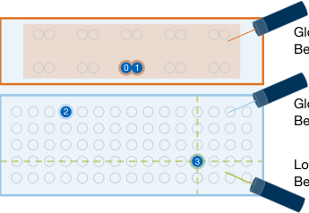

## Consequently, the rearrangement of atoms in preparation of a
layer of two-qubit operations may incur multiple rearrangement
steps. However, since the state of the atoms decoheres over
time [2], the duration of the quantum computation must be
minimized to achieve high fidelity. Thus, the rearrangement
constraints are central to the compilation and significantly
contribute to its complexity.

Global Rydberg
Beam (CZ-Gates)

Entanglement

Zone

0 1

Global Raman
Beam (RY-Gates)

2

Storage

Zone

3
Local Raman 
Beam (RZ-Gates)

## B. Overview of Corresponding Compilers

*Figure 1. Schematic of a zoned neutral atom architecture illustrating global
and local operations on atoms (blue).*

## Compiling quantum circuits with many quantum gates to
different kinds of neutral atom architectures is an active research
field. Early developments focused on an architecture with
individually addressable entangling gates and SWAP gates
to route qubits on a grid of static traps [23]–[25]. However, the
optical setup required for individually addressable entangling
gates could not reach the same fidelity as zoned architectures
yet (92.5% vs. 99.5% fidelity [21], [26]). A different line of
research focuses on architectures capable of rearranging atoms
with AODs but still with a monolithic design, i. e., one zone
with a global Rydberg beam [27]–[38]. So far, only a few
compilers consider zoned architectures.

One-qubit operations, such as rotational operations, are re-
alized through state transitions driven by global and local
lasers [16], [20]. Two-qubit operations, such as CZ operations,
are realized by global Rydberg beams [21], [22]. The Rydberg
blockade mechanism ensures that only the qubits within the
interaction radius of each other interact in the current tech-
nology. However, isolated atoms still experience an imperfect
identity operation as they are still excited to the Rydberg state,
leading to Rydberg decay—a significant source of errors [21].

To mitigate those errors, zoned architectures perform opera-
tions in designated spatially separated zones [2], such as the
entanglement zone and the storage zone, as shown in Fig. 1.
The entanglement zone features spatially separated pairs of
traps such that atoms in the same pair can interact with each
other but not with atoms in other traps. The Rydberg beam
only affects atoms in the entanglement zone, and multiple
CZ operations can be performed in parallel. During two-qubit
operations, atoms in the storage zone are shielded—leading
to significantly higher coherence times [2]. Without the need
to keep a separation between atoms for unwanted interactions,
the storage zone offers many densely packed traps to store
atoms. Each trap is realized as a static optical tweezer created,
e. g., by a Spatial Light Modulator (SLM, [16]) and holds up
to one atom (aka qubit).

## In fact, NALAC just recently proposed in [13] initiated
this line of research. It reduces the time-costly trap transfers
by keeping one set of atoms in AODs while sliding past the
other set of atoms and performing multiple CZ-gates in one
go. The tool, proposed in [3], generates optimal schedules for
state preparation circuits used for quantum error correction. Its
evaluation demonstrates clearly that shielding idling qubits in
the storage zone is crucial to achieving high fidelity. A fact that
the tools ZAC [4] and ZAP [39] take advantage of. In addition,
they detect reuse opportunities, i. e., they keep qubits in the
entanglement zone if they are involved in consecutive two-qubit
gates. Besides those general-purpose compilers, Artic [40] was
proposed to tackle one specific architecture. Mantra [41] targets
the architecture, which can only execute one-qubit gates in
the storage zone. This tool defines rewrite rules to replace
common patterns in quantum circuits with ones better suited
for neutral atom architectures. However, all these methods are
too specific for compiling general quantum circuits or generate
an unnecessary large rearrangement overhead.

The usual course of execution of two-qubit operations is to
move qubits from the storage zone to the entanglement zone,
perform the operation, and move them back to the storage
zone. Those rearrangements are realized by an additional kind
of adjustable optical tweezers controlled by Acousto-Optic
Deflectors (AODs, [16]). These AODs can pick up atoms from
static traps, move them via stretching the AOD columns and
rows, and drop them in other static traps, constituting one
rearrangement step. Transferring between traps may cause
atom loss [2], which can be solved by atom reload in the
future [18]. On the other hand, atom movement does not incur
errors in the qubits if the speed is below a certain threshold.

## III. MOTIVATION:
UNTAPPED POTENTIAL IN EXISTING COMPILERS
Following the established compilation flow, the compilation
of quantum computations for zoned neutral atom architectures
is divided into several stages. The fidelity of the resulting

Multiple atom movements can be performed in parallel,
referred to as one rearrangement. However, in doing so, the
following rearrangement constraints (as specified in [13] and
illustrated in Fig. 2) must be obeyed:

## 0
1
1
0
1
0
0

## 1

## 1
0

## 1
0

## • Non-Crossing: During one rearrangement step, the rows
and columns of AOD traps must not cross each other to
prevent atom loss and heating [13], cf. Fig. 2a.

## (a) Non-crossing constraint
(b) Preservation constraint

## 1
Pick-up

## 2
1
2

## 0
2
1

## Atom in SLM

## • Preservation: Additionally, qubits starting in the same
row or column must stay in the same row or column,
respectively, cf. Fig. 2b.

## 0

## 0
0

## Atom in AOD

## 0

## (c) Ghost-spot constraint

## • Ghost-Spots: When transferring atoms from and to AOD
traps, atoms at all grid points of the rows and columns
are affected, cf. Fig. 2c.

*Figure 2. Rearrangement Constraints: The middle frame of each sub-figure
shows the intended rearrangement, the left one a violation, and the right a
possible workaround.*

<!-- page 3 -->

Input

## Output

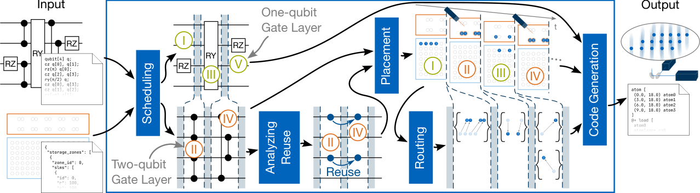

## One-qubit 
Gate Layer

## t

Placement

## 0
0

## 2
1
3
2

## I

RZ

## 0 3
2 1

## RZ

## 0
1
3
2

## Code Generation

RY
RZ

## 3
1

## RY
RZ

qubit[4] q;
cz q[0], q[1];
rz(π) q[0];
cz q[2], q[3];
ry(π/2) q;
cz q[0], q[3];
cz q[1], q[2];
rz(-π) q[1];

## V

## II
IV
I
III

Scheduling

## III

## atom [

## (0.0, 18.0) atom0
(3.0, 18.0) atom1
(6.0, 18.0) atom2
(9.0, 18.0) atom3
]
@+ load [

## 0 1
3
2}
{
3
1

## 1
3}
{
}
{

## IV

## 1

Analyzing

## atom0
atom1zone_cz0

## IV

## Routing

Reuse

## 0
1
3
2

## 1

## II

## II

## }
{

{

"storage_zones": [

{

## 3

## Two-qubit 
Gate Layer

"zone_id": 0,
"slms": [

## Reuse

## 3

{

"id": 0,
"r": 100,
"c": 100,

*Figure 3. The common compilation flow for zoned neutral atom architectures. It takes a quantum circuit and the zoned neutral atom architecture specification
as input and generates a sequence of target-specific instructions.*

## quantum computation depends mutually on the result of all
stages. This section reviews those stages and then unveils
substantial potential missed in available compilers.

## placement, and the routing determined before and generates a
sequence of target-specific instructions. The output is a program
to be executed on a zoned neutral atom quantum computer.

## B. Potential for Improvement

## A. Compilation Flow

## As reviewed above, the placement significantly impacts
the routing stage during the compilation flow. It directly
influences the level of parallelism one can achieve in the
routing stage and, by this, the rearrangement time during the
quantum computation. However, placement methods such as,
e. g., proposed in [4], [39], heavily rely their placement on
minimizing the accumulated travel distance of atoms. While
this, at first glance, seems like an appropriate heuristic, it may
make routing afterward considerably harder.
Example 1. Consider the scenario sketched in Fig. 4, where
one atom in the entanglement zone is reused from the previous
two-qubit gate layer, and three other atoms initially located
in the storage zone will be moved to the entanglement zone.
Mainly optimizing for accumulated movement distance yields
the placement as shown in Fig. 4a. While atoms are indeed
close, this placement prohibits the parallel movement of all
three atoms indicated by the grey arrows as this would
violate the non-crossing constraint (cf. Sec. II-A). Hence, the
routing stage must split the movements into two rearrangement
steps. In contrast, a placement that already considers such
constraints could generate a solution as shown in Fig. 4b.
Here, all movements are compatible and it requires only one
rearrangement step.

## A compiler receives (1) a quantum circuit to execute and
(2) a zoned neutral atom architecture specification as input. It
transforms the quantum circuit into a sequence of target-specific
instructions that align with the constraints of the architecture.
To this end, the flow is usually separated into several stages
as illustrated in Fig. 3 and briefly reviewed in the following:

## Scheduling: This stage schedules all gates of the input
circuit into two types of layer: One-qubit gate and two-qubit
gate layers. All two-qubit gates in one layer must be executable
in parallel, i. e., they must not share qubits. The resulting
schedule consists of a sequence of alternating one-qubit
and two-qubit gate layers—some one-qubit gate layers may
be empty, though. The default setting for this stage is an
as-soon-as-possible scheduling as, e. g., in [4] that puts every
gate in the earliest possible layer.

## Analyzing Reuse: This stage is optional but very beneficial
and, e. g., used by compilers such as [4]. It detects reuse
opportunities: When an atom takes part in two consecutive
two-qubit gate layers, it can remain in the entanglement zone,
i. e., it can be reused without the need to move it back to the
storage zone. This significantly improves the overall fidelity
because it reduces the number of necessary trap transfers.

## Placement: This stage determines the location of every
atom in each layer. It takes the set of independent two-qubit
gates per two-qubit gate layer from the schedule. Based on
this input, it produces the resulting placement as output. In
every two-qubit gate layer, the atoms belonging to one gate
must be placed in a pair of traps in the entanglement zone,
cf. Sec. II-A. All remaining atoms should be placed in the
storage zone to shield them from the Rydberg beam and avoid
decoherence due to the Rydberg decay.

## The example clearly demonstrates that the overall solution
can be improved by considering the rearrangement constraints
during the placement stage. To this end, we propose the concept
of routing-aware placement.

## Routing-Aware Placement: While performing the place-
ment stage reviewed in Sec. III-A, routing-aware placement

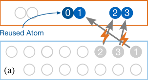

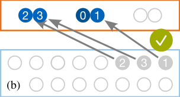

## 0 1
2

## 3
0 1
2

## 3

## Routing: The routing stage takes the placement and
determines the necessary rearrangements of the atoms to
transition from the placement of one layer to the next. The
rearrangement constraints (cf. Sec. II-A) must be obeyed
during this process. These constraints may necessitate multiple
rearrangement steps to transition from one layer to the next.

## Reused Atom

## 1
2
3
1
2
3

## (a)
(b)

*Figure 4. The routing-agnostic placement (a) requires two whereas the routing
aware-placement (b) requires only one rearrangement step. The atoms’ current
locations are depicted in grey, and their new locations in blue.*

## Code Generation: The final stage combines the results
from the previous stages. It incorporates the schedule, the

<!-- page 4 -->

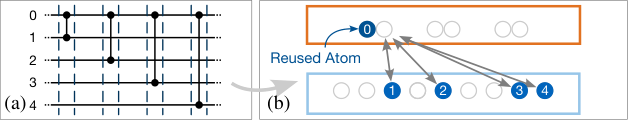

reduces the number of rearrangement steps in the subsequent
routing stage and, hence, reduces the rearrangement time during
the resulting quantum computation. To this end, routing-aware
placement groups placed atoms corresponding to compatible
movements for each transition from one layer to the next.
Then, the main objective is to minimize the sum of the group’s
rearrangement duration. Since all movements in each group
can be performed in parallel, this objective minimizes both the
number of rearrangement steps and the atoms’ travel distances.

## 0

## 0

## 1
Reused Atom

## 2

## 1
4
2
3
3

## (a)
(b)

## 4

*Figure 5. There are situations where reuse is detrimental to the duration.*

## Look-ahead Cost: There may be multiple choices with
similar associated costs while placing atoms. However, some
can be more beneficial for upcoming two-qubit gate layers
than others. When placing an atom closer to the atom’s next
interaction partner, the resulting duration of the quantum
computation can be further reduced. Furthermore, look-ahead
allows us to detect situations where reuse is detrimental.
Example 2. Consider the circuit in Fig. 5a. The atom 0 can
be reused for all four layers. However, this leads to very long
movements for the atoms 3 and 4, and not reusing the atom 0
after the first two gates would be more beneficial.

IV. PROPOSED SOLUTION: UNLEASHING THE POTENTIAL

WITH ROUTING-AWARE PLACEMENT

The previous section has shown that routing-aware placement
could tap huge potential. However, the search space for possible
placements is gigantic, and we need efficient methods to explore
it. This section proposes an approach to handle the resulting
complexity and, by this, utilize the potential of routing-aware
placement. With this basis, Sec. V provides its implementation
details before Sec. VI evaluates its effectiveness.

## Using look-ahead, the cost of moving the next interaction
partner of a reused atom can be considered when deciding
whether to reuse that atom. Without the look-ahead, the future
cost of reusing an atom cannot be estimated.

A. The Search Space

The placement of the atoms is determined sequentially for
every two-qubit gate layer and in between, resulting in two
types of placements:

## All considerations from above yield a gigantic number of
possible placements—more precisely, exponentially many in
the number of atoms. Overall, the objective is to find the best
one, i. e., the one with the lowest cost.
Example 3. Assume a modest number of eight CZ-gates were
performed in parallel. Afterward, 16 atoms in the entanglement
zone must be returned to the storage zone. Even if we limit
the search to, e. g., the 36 nearest traps in the storage zone
for each atom (cf. pruning strategies in Sec. V-D), this results
in 3616 ≈1.3 × 1024 possible placements.

• A gate placement, where all atoms involved in a two-qubit
gate are placed in paired traps in the entanglement zone
while all remaining atoms are shielded in the storage zone.

• An intermediate placement, where all atoms not reused
in the following two-qubit gate layer, are placed back in
the storage zone.
To begin with, an initial (intermediate) placement of the atoms
in the storage zone is determined. Then, each placement is
constructed based on the previous one.

## Obviously, naively enumerating all these placements is
infeasible for relevant circuit sizes. Hence, sophisticated
methods are needed to consider as few as possible placements
until a (near-)optimal solution is found.

As illustrated in Fig. 4, some placement solutions are
more favorable than others: A good placement corresponds
to a fast transition from the previous placement, i. e., a few
rearrangement steps and short distances for the atoms to travel.
We reflect this objective in the following cost function defined
as the sum of two parts: (1) a proxy for the actual routing cost,
and (2) a look-ahead part to achieve a better global solution.

## B. Taming the Search Space with A*

## To tackle this complexity, we propose to use the A* algo-
rithm [14]. It has already proved successful in similar scenarios
to cope with a huge search space, such as routing qubits
on superconducting chips [42]. To this end, finding the best
placement for each layer is encoded into a state-space search in
the following manner. First, all atoms that must be rearranged
are identified: For a gate placement, these are the atoms
involved in a gate but not reused from the previous layer;
conversely, for an intermediate placement, these are the atoms
in the entanglement zone that are not reused in the next layer.
Second, the placement is determined following a gate-by-gate
strategy for gate placements and an atom-by-atom strategy for
intermediate placements. Note that the placement of a gate is
the mapping of the respective atoms to the paired traps in the
entanglement zone. The location of the remaining atoms is
copied from the previous placement.

Proxy for Actual Cost: The exact duration of the transition
is determined later by the routing stage. As we cannot
generate an exact routing solution for each placement candidate
considering its complexity [4], an efficiently computable yet
accurate proxy for the routing cost is essential. To this end, the
atom movements corresponding to the placement are grouped
greedily into groups of compatible movements. Movements
are compatible if performed in parallel without violating the
rearrangement constraints reviewed in Sec. II-A.

More precisely, let dmax (𝐺) be the maximum travel distance
of an atom in group 𝐺. Then, the cost of a placement 𝑝is
calculated as

∑︁

## √︁

cost (𝑝) :=

## dmax (𝐺) .
(1)

## Starting from a start node corresponding to the state where
none of the atoms to be moved are placed yet, A* finds the path
to the goal node representing the cheapest placement concerning
the cost function from Sec. IV-A. On that path, the nodes
between the start and goal nodes represent intermediate partial

𝐺∈groups( 𝑝)

## Note that the square root is used because the movement
duration is proportional to the square root of the travel
distance [16]. This favors fewer groups with shorter movements.

<!-- page 5 -->

0 1
2 3
4 5

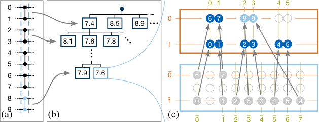

## heuristic, A* goes a lot more into breadth instead of depth—
slowing down the search. Thus, we add an accelerating part to
the heuristic to guide the search more aggressively—accepting
that the resulting heuristic may not be admissible anymore.
The accelerating part estimates how likely conflicts arise when
an intermediate node’s partial placement is extended to a
full placement. It, then, favors partial placement with fewer
anticipated conflicts. To this end, we follow the following
rationale: Rearrangements that retain existing gaps from the
previous placement are more straightforward to extend with
new placements.

0

0
8 9

## 6

## 7

1

## 7.4
8.5
8.9

2

## 8.1
7.6
7.8

3

## 0 1
1

## 2

## 3
4 5

4

5

## 7.9
7.6

## 0

6

## 7

6

7

8

## 1

## 0
3
4
5

2
1

## 8
9

9

## (a)
(b)
(c)

## 0
1
2
3
4
5
6
7

*Figure 6. (a) a layer of five CZ gates. (b) the search tree for the placement of
five CZ gates with the associated cost in each node. (c) the placement of the
atoms of the first four CZ gates (blue) and the ones of the last (light blue).*

## Example 5. Consider the situation shown in Fig. 7, where the
previous location of all atoms in the upper zone is depicted in
grey. Figure 7a depicts a placement of the atoms 0 to 3 where
the vertical gap between them is preserved. Consequently, the
atoms 4 and 5 can be placed in the gap without causing a
conflict. Conversely, Fig. 7b shows a placement of the atoms 0
to 3 where the gap is not preserved. Thus, any placement of
the atoms 4 and 5 causes a conflict.

## placements. More precisely, a node inherits its predecessor’s
placement and adds one additional atom or gate.

## Since we follow an atom-by-atom or gate-by-gate strategy,
the neighbors of the start node represent the possible placements
of the first atom or gate, respectively. In turn, their neighbors
correspond to the possible placements of the first two atoms
or gates. This goes on until all atoms or gates are placed. This
eventually results in a representation of the search space as a
tree.
Example 4. Consider the two-qubit gate layer in Fig. 6a with
five gates. The rectangular nodes in the first level of Fig. 6b
represent the various options to place the first gate involving
atom 0 and 1 together with their estimated cost inscribed in
the nodes. In the second level, some placement options for the
second gate are shown, extending the first placement option for
the first gate. Finally, the two nodes in the last level correspond
to the placement options of the fifth gate. All other nodes are
omitted. Figure 6c shows the placement represented by the
light blue node in Fig. 6b, where the atoms 8 and 9 are placed
in the middle of the top row. Since it is a node of the last level,
the location of the atoms 0 to 7 is already fixed.

## To favor placements like the one in Fig. 7a, the heuristic
analyzes the partial placement, such as the one of the atoms 0
to 3 in Ex. 5 and assigns a lower estimate of the additional
cost to those with a similar spacing between the placed atoms
as in the previous placement.

## Look-ahead Part:
After the look-ahead cost from
Sec. IV-A is added to the actual cost, its value increases and
outweighs the present heuristic cost, so the heuristic cost fails
to accelerate the search. In particular, this effect diminishes the
indented acceleration by the accelerating part of the heuristic.
Thus, we also design a heuristic cost for the look-ahead part
to recover the acceleration. To this end, we add the average
look-ahead cost of all options of each unplaced atom or gate.

## The evaluation in Sec. VI shows that the proposed heuristic
manages to guide the search towards a solution with few
rearrangement steps. At the same time, the increase in the
placement time remains moderate because of the strategy
proposed above and its following efficient implementation.

## The A* algorithm explores the search space from the start
node until it finds a goal node. To this end, it extends the
well-known Dijkstra’s algorithm [43] by using a heuristic
function to guide the search faster towards some goal. For
every new node it encounters, it calculates the cost of the
current node and adds an estimate of the remaining cost for the
goal node. The next node expanded is the one with the lowest
estimated overall cost. A heuristic that never overestimates
the cost to reach the goal is called admissible. Only with an
admissible heuristic A* is guaranteed to find the optimal path.

## V. IMPLEMENTATION

## Using the concepts introduced in Sec. IV, their efficient
implementation is key to the success of the proposed approach.
In fact, to implement the proposed approach we employ a
dedicated data structure to enable efficient computation of
the cost and heuristic function. Moreover, we also incorporate
pruning strategies to further reduce placement time. This section
provides details on their implementation.

## C. The Heuristic Guiding the Search

## The sheer size of the search space quickly renders an
unguided search infeasible. Hence, we need a good heuristic to
guide the search faster toward a goal. The proposed heuristic
is defined as the sum of three parts: (1) an admissible part,
(2) an accelerating part, and (3) a look-ahead part.

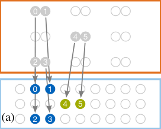

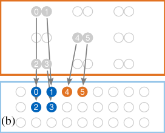

## 0

## 0 1

## 0 1

## Admissible Part: The admissible part of the heuristic is
equal to the lower bound of the cost’s increase until a goal node
is reached. For the lower bound, we assume that all remaining
movements can be added to existing groups of compatible
movements. Hence, the number of groups does not change;
only the maximum distance per group may increase.

## 1

## 4 5

## 4 5

## 2

## 2 3

## 2 3

## 4
5
0
1
2

## 0
1
0
1

## 4
5

## 2
3

## (a)
(b)

## 2
3

## Accelerating Part: Using only the admissible part of the
heuristic does not sufficiently accelerate the search. Whenever
the actual cost is significantly higher than the estimate by the

*Figure 7. (a) placement requiring one rearrangement step. (b) placement
requiring two rearrangement steps.*

<!-- page 6 -->

## of gate 𝑔1 is reused in the next layer by gate 𝑔2 acting on
atom 𝑎2 and the reused atom 𝑎1, then the look-ahead cost is
the cost to move the atom 𝑎2 from its current location next to
the reused atom 𝑎1. Let costl(𝑔) be that cost for any gate 𝑔
acting on a reused atom and 0 otherwise.

A. Dedicated Data-Structure

To facilitate performance, each node stores the corresponding
groups of compatible movements in a dedicated data structure
that allows for an efficient check of whether a new movement
is compatible with the existing groups. To relate the relative
location of the atoms in the source and target area, the source
locations of the atoms are rearranged, and the target traps are
discretized among all the atoms to be moved.
Example 6. The source location of the (grey) atom 0 in the
lower left of Fig. 6 is not identified by the actual row and
column of the zone but by the row ¯1 and column ¯0, which is the
discrete row and column among all atoms that are rearranged.

## For intermediate placements, if, in the next layer, gate 𝑔1
involves atoms 𝑎1 and 𝑎2, atom 𝑎1 might be identified as
reusable, cf. Sec. III-A. Then, the reuse of atom 𝑎1 is treated
as another option, just like every other placement of atom 𝑎1.
Hence, two cases must be distinguished: If atom 𝑎1 is reused,
it remains at its location in the entanglement zone, and the
look-ahead cost is the cost to move atom 𝑎2 from its current
location next to the reused atom 𝑎1. In this case, we subtract a
constant 𝛾from the look-ahead cost of atom 𝑎1 corresponding
to the gained fidelity by saving two trap transfers when reusing
the atom. This cost is denoted by costr(𝑎) for any atom 𝑎.
Conversely, if atom 𝑎1 is not reused or not reusable in the first
place, it is moved to the storage zone and the look-ahead cost
is equal to the cost to move atom 𝑎2 from its current location
to the new location of atom 𝑎1. Let this cost be denoted by
costl(𝑎) for any atom 𝑎if in the next layer a gate acts on
atom 𝑎and it is not reused; otherwise, costl(𝑎) is 0.

Two mappings can express every atom’s movement: Its
source row and column to its target row and column, respec-
tively. Each group stores the row and column of the atoms with
compatible moves in separate binary trees, where the entries
are sorted by their source row or column, respectively.
Example 7. Figure 8 shows the binary search trees containing
the row and column mappings of the placement of the atoms
belonging to the first four CZ-gates in Fig. 6c.

A new placement is compatible with an existing group if
the new row and column mappings are compatible with the
existing ones in the respective trees. A new mapping 𝑘↦→𝑣
is compatible if and only if either of the following holds:

## In the following formal definition of the final cost function
of a (partial) placement 𝑝, the user-defined parameter 𝛼adjusts
the influence of the look-ahead. The cost for reusing an atom is
purposefully not affected by 𝛼because it represents the actual
cost of the movement of its interaction partner in the next layer
rather than being an estimate for future costs. Overall, this
yields

(1) The key 𝑘is already contained in the tree and maps to

the same value 𝑣.
(2) If the key 𝑘is not contained, let 𝑘lower, 𝑘upper be the next

lower and upper key mapping to 𝑣lower, 𝑣upper, respectively.
Then the new mapping is compatible if and only if
𝑣lower < 𝑣< 𝑣upper.
The condition (1) ensures that all atoms in the same row
or column remain during a rearrangement in the same row or
column, respectively. The condition (2) ensures that the relative
order of the atoms is preserved and that no rows or columns
are merged during a rearrangement.
Example 8. The placement of atom 8 in Fig. 6 is not compatible
with the existing placements in two ways: First, when the key

## ∑︁

## ∑︁

## cost∗(𝑝) := cost (𝑝) +

## o
costr(𝑎) + 𝛼·

## o
costl(𝑎) . (2)

## n
placed
gates/atoms

## nplaced reused

## 𝑎∈

## 𝑎∈

## atoms

## C. The Heuristic

## As stated in Sec. IV-C, the admissible part only covers the
additional cost for the goal node in the optimal case, i. e., when
all future placements are compatible with existing ones. In this
case, the number of summands in Eq. (1) remains fixed, and
the cost may only increase when the maximum distance of a
group increases. The maximum distance of any group is bound
from below by the maximum distance of an unplaced atom to
its nearest free trap. The increase of the cost function, which
uses the square root of the distance, is then bound from below
by the following difference defining the admissible part of the
heuristic

¯0 is looked up in the row mappings depicted in Fig. 8a, the
mapping ¯0 ↦→0 is found and 0 = 1 is not satisfied; Second, the
column mappings shown in Fig. 8b do not contain the key ¯3.
Hence, the next lower and upper keys are retrieved, which
correspond to the mappings ¯2 ↦→2 and ¯4 ↦→3. The inequality
2 < 2 < 3 obviously does not hold.
When expanding a new node during the search, the respective
movement of the newly placed atom is either put into an
existing group of compatible movements or if no such group
exists, a new group is created with the new movement.

## √︁

## √︁

## h (𝑝) :=
max

## dmax(𝐺) −
max
𝑎∈
{unplaced atoms}

## dmin(𝑎) .
(3)

## 𝐺∈
groups( 𝑝)

## To return an estimate of the likelihood of conflicts, the
heuristic’s accelerating part first calculates the difference
between every value and key in each binary tree. Then, it
computes the standard deviation of these differences per binary
tree representing the groups of compatible movements. Those
standard deviations are then summed up and multiplied by the
number of atoms that still need to be placed because a higher
deviation is more problematic when more atoms must still be
placed. Before the multiplication, a constant 𝛽is added to the
sum to prioritize nodes further down in the tree. The result is
multiplied by a user-defined factor 𝛿to adjust the influence of
this factor and added to the previous heuristic, leading to

B. The Look-Ahead

The look-ahead cost introduced in Sec. IV-A differs for gate
and intermediate placements. For gate placements, if atom 𝑎1

0 ↦ 1
?

## 3 ↦ 2
?

## Row Mappings
2 ↦ 2

## Column
Mappings

## Lower
Bound

0 = 0

## 2 < 3

0 ≠ 1
0 ↦ 0

## 5 ↦ 4
1 ↦ 1

## Upper
Bound

## 2 < 2

1 ↦ 1

## 0 ↦ 0
4 ↦ 3
6 ↦ 5

## (a)
(b)

*Figure 8. Binary search tree containing the row and column mappings of the
placement of the atoms belonging to the first four CZ-gates in Fig. 6c.*

<!-- page 7 -->

## Setting

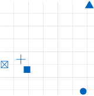

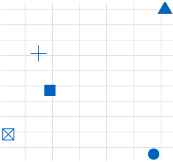

## Σ Rearrangement Time [ms]

## Σ Rearrangement Steps

·

o , (4)

n

∑︁

## 170

unplaced
gates/atoms

h (𝑝) := h (𝑝) + 𝛿· ©

𝛽+

SD (𝐺)ª®

## Default
α = 0.2, β = 0.2, δ = 0.6

## 1430

## 169

## No Look-ahead
α = 0.0, β = 0.6, δ = 0.6

𝐺∈groups( 𝑝)

«

¬

## 168

## 1410

## Quick
α = 0.2, β = 0.6, δ = 0.6

where SD is the standard deviation of the key-value differences.

## 167

## Quicker
α = 0.2, β = 0.6, δ = 0.8

## 1390

To handle significant discrepancies in column and row count
between the discrete source and target locations, the key is
multiplied with a scaling factor before subtracting it from the
value. This factor is determined such that a rearrangement
with a standard deviation close to 0 corresponds to a more or
less parallel movement of atoms without changing the spacing
between them.
Example 9. Figure 9a shows a placement that the heuristic
would favor without the scaling factor because all key-value
differences are equal and the standard deviation is zero. By
multiplying the key with the scaling factor 2 (8 target cols.
divided by 4 source cols.), the heuristic prefers the better
placement in Fig. 9b instead. Here, the standard deviation
of the differences [0, −1, 0, −1] including the scaling is 0.5
compared to, e. g., 1.1 for the placement in Fig. 9a.

## 166

## Quickest
α = 0.2, β = 1.2, δ = 0.8
(b)

## 40
60
Ø Placement Time [ms]

## 40
60
Ø Placement Time [ms]

## (a)

*Figure 10. Trade-off between placement time and result quality.*

## A. Experimental Setup and Parameter Study

## We implemented the proposed method in C++. To demon-
strate the effectiveness of the placement technique, we afterward
compared it against the state-of-the-art compiler ZAC [4]. For
a fair runtime comparison, we re-implemented ZAC, including
the routing-agnostic placement in C++. The complete code is
publicly available in open-source as part of the MQT [15]
under https://github.com/cda-tum/mqt-qmap/. All experiments
were conducted on an Apple M3 with 16GB of RAM.

## As benchmark circuits, we used the ones considered
originally for the evaluation of ZAC [4] (taken from
QASMBench [44]). This set is complemented with additional
circuits of larger sizes (taken from MQT Bench [45]).

As mentioned in Sec. IV-C, the heuristic’s look-ahead part
adds the average look-ahead costs across all options to keep the
accelerating effect. Formally, the variable costl(𝑎) represents
the average look-ahead across all placement options of atom
or gate 𝑎(this includes the full costs for reused atoms and
the with 𝛼scaled look-ahead costs). This results in the final
heuristic function

## The routing-aware placement proposed above offers several
parameters to tune its performance. We conducted a parameter
study to find suitable parameter combinations for each of the
two benchmark sets. To this end, we varied the parameters 𝛼,

## 𝛽, 𝛾, and 𝛿and collected the number of rearrangement steps,
the rearrangement time, and the time for the placement and
routing stages. This allows us to determine proper parameter
settings.

## ∑︁

## h∗(𝑝) := h (𝑝) +

## o costl(𝑎) .
(5)

## n unplaced

## 𝑎∈

## gates/atoms

## As an example, Fig. 10 shows the results of this parameter
study for the QASMBench benchmark set.1 More precisely,
Fig. 10a shows the sum of the rearrangement steps overall
benchmarks in the QASMBench set against the average
time for the placement stage for five different parameter
combinations. Figure 10b, then, shows the corresponding
accumulated rearrangement time. Since the goal is to minimize
the rearrangement steps and time, the parameter combination
corresponding to the lowest values in the plots yields the
highest-quality solutions. In particular, it shows that the
look-ahead is crucial in improving the quality of results.

## D. Pruning Strategies

## Only the most likely target traps are considered during the
search to reduce the number of potential nodes in the search
space. To this end, an adjustable-size window is employed
and centered around the nearest target trap for each atom.
All target traps within this window are considered placement
options during the search. Should the case arise that the window
is too small in the sense that it contains too few free traps, the
window is expanded automatically.

## Based on that, we derived that the parameter combination
𝛼= 0.2, 𝛽= 0.2, 𝛾= 5, and 𝛿= 0.6 is best for the benchmark
set from QASMBench. Analogously, the larger circuits from
MQT Bench, the parameter combination 𝛼= 0.2, 𝛽= 0.8,
𝛾= 5, and 𝛿= 0.9 led to the best results.

## VI. EVALUATION

## The proposed method constitutes the first routing-aware
placement for zoned neutral atom architectures. To evaluate
its effectiveness, all methods and data structures have been
implemented and, afterward, compared to the state-of-the-art
routing-agnostic placement method. This section summarizes
the correspondingly obtained results. To this end, we first
describe the setup and results of a parameter study before the
results of this comparison are provided and discussed.

## B. Comparison to the State-of-the-Art

## Using the setup described above, we eventually com-
pared the performance of the proposed approach against the
state-of-the-art, i. e., the approach proposed in [4]. To this end,
we considered the following metrics:

## • Placement time: The time required by the placement stage.

## • Routing time: The time required by the routing stage.

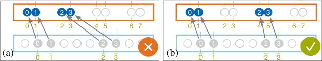

## 0 1

## 2 3

## 0 1

## 2 3

## • Rearrangement steps: The number of rearrangement steps
required during the execution of the quantum computation
based on the compilation result.

## 3
2
0
5
4
1

## 7
6

## 3
2
0
5
4
1

## 7
6

## 0
1
2
3

## 0
1
2
3

## 0
2
1
3
(a)
(b)

## 0
2
1
3

*Figure 9. By scaling keys before calculating the standard deviation the heuristic
favors parallel movements, cf. Ex. 9.*

## 1Due to space limitations, we skipped listing corresponding results for the
MQT Bench benchmark set.

<!-- page 8 -->

Table I. ROUTING-AGNOSTIC VS. ROUTING-AWARE PLACEMENT
Benchmark
Max.
Routing-Agnostic (State-of-the-Art)
Routing-Aware (Proposed Solution)
Num.
Num.
Num.
2Q-Gates
Time [ms]
Num. R.
Rearr.
Time [ms]
Num. Rearr.
Rearr.
Qubits
2Q-Gates
Layers
in Layer
Place.
Rout.
Steps
T. [ms]
Place.
Rout.
Steps
Time [ms]
graphstate1
60
60
4
22
3.3
0.15
56
8.5
27.4
0.13
37 (–34%)
6.9 (–19%)
100
100
6
37
10.4
0.27
88
17.3
1860.5
0.30
62 (–30%)
11.9 (–31%)
wstate1
200
398
201
2
21.6
0.23
643
83.5
98.4
0.21
493 (–23%)
57.4 (–31%)
qft1
200
9350
794
13
374.0
6.32
4300
619.9
1309.3
4.75
3534 (–18%)
546.8 (–12%)
500
24 350
1994
13
1138.4
15.61
10 391
1635.7
3060.8
14.10
9911 ( –5%)
1554.9 ( –5%)
qpeexact1
200
9697
1187
13
489.6
5.64
4766
692.8
1482.7
5.13
4306 (–10%)
651.8 ( –6%)
ising2
42
82
4
21
2.4
0.07
22
3.1
451.2
0.05
9 (–59%)
1.6 (–49%)
98
194
4
49
16.9
0.23
23
3.2
417.9
0.16
12 (–48%)
1.9 (–43%)
qft2
18
306
66
9
8.7
0.13
185
21.9
32.7
0.10
148 (–20%)
20.3 ( –8%)
29
680
110
9
18.6
0.36
434
57.6
64.4
0.21
284 (–35%)
40.5 (–30%)
bv2
30
18
18
1
1.1
0.01
37
4.3
5.4
0.01
36 ( –3%)
4.1 ( –3%)
70
36
36
1
3.3
0.01
73
11.0
11.4
0.01
76 ( +4%)
8.5 (–23%)
wstate2
27
52
28
2
2.4
0.02
73
8.3
11.1
0.02
62 (–15%)
6.7 (–19%)
seca2
11
80
37
3
3.0
0.03
112
12.2
13.2
0.02
81 (–28%)
9.9 (–18%)
ghz2
40
39
39
1
2.1
0.01
78
9.6
12.4
0.01
79 ( +1%)
8.7 (–10%)
78
77
77
1
6.0
0.03
154
20.9
23.5
0.03
157 ( +2%)
17.4 (–17%)
multiply2
13
40
23
3
1.6
0.02
68
7.6
8.1
0.02
54 (–21%)
6.5 (–15%)
cat2
22
21
21
1
0.9
0.01
43
4.6
6.5
0.01
42 ( –2%)
4.5 ( –2%)
35
34
34
1
1.9
0.01
69
8.2
10.4
0.01
69 ( ±0%)
7.5 ( –8%)
swaptest2
25
84
62
12
4.3
0.05
127
13.4
27.3
0.05
121 ( –5%)
12.3 ( –8%)
knn2
31
105
77
15
5.4
0.08
158
16.7
63.1
0.06
149 ( –6%)
15.5 ( –7%)
∅
100.8
1.40
155
1042.9
428.5
1.21
143 (–17%)
939.1 (–17%)

• Rearrangement time: the total time required to rearrange
the atoms during the quantum computation based on the
compilation result. This time time is calculated based on
the relation 𝑡= (𝑑/ 2750 m

routing-aware approach significantly reduces the number of
required rearrangement steps on most of the benchmarks,
especially, those exhibiting a large degree of parallelism. For
example, the rearrangement steps were almost halved for the
ising benchmark with 98 qubits. On average, the number of
rearrangement steps is reduced by 17% across all benchmarks.

s2 )1/2 and 15 µs for every trap
transfer [16].

The obtained results are summarized in Table I. The first
section of Table I lists the benchmarks and summarizes key
statistics relevant to the placement and routing, namely, the
number of qubits, the number of two-qubit gates, and the
number of layers. Hereby, a layer corresponds to a set of
independent two-qubit gates part of the sequence returned by
the scheduler, cf. Sec. III-A. Additionally, we list the maximum
number of two-qubit gates in a layer as this determines the size
of the search space, cf. Sec. IV-A. Benchmarks stemming from
MQT Bench are marked with 1 and those from QASMBench
with 2.

This substantially reduces the corresponding rearrangement
times (one main metric affecting the fidelity of the quantum
computation). In fact, these times are consistently lower for
all benchmarks also for the cases where the rearrangement
steps slightly increased. This is because the additional rear-
rangement steps reduce the travel distance and, consequently,
the rearrangement time. Overall, the routing-aware placement
reduces the rearrangement time by up to 49% in the best case
and 17% on average across all benchmarks.

VII. CONCLUSIONS
In this work, we presented the first routing-aware placement
for zoned neutral atom architectures. In contrast to existing
compilers, the proposed approach considers rearrangement
constraints during the placement stage. Evaluations demon-
strated that this approach effectively reduces the number of
rearrangement steps in the subsequent routing stage. Especially
on benchmarks exhibiting a large degree of parallelism, the
proposed method can almost halve the number of rearrangement
steps. Its implementation is publicly available in open-source as
part of the MQT under https://github.com/cda-tum/mqt-qmap/.

The second and third sections summarize the obtained results
of the routing-agnostic placement (i. e., the state-of-the-art
method proposed in [4]) and the routing-aware placement
(proposed in this work), respectively. For both approaches,
the metrics mentioned above, i. e., placement time, routing
time, number of rearrangement steps, and rearrangement time,
are listed. Animations of the resulting atom’s rearrangements
for selected benchmarks are available under https://doi.org/10.
5281/zenodo.15236196.
First, the results show that the time for the placement
increases due to the gigantic search space. This was expected
(see also discussion in Sec. IV-A and Ex. 3), but, using
the proposed approach and its efficient implementation, the
overhead remains moderate. In fact, all benchmarks (the small
ones previously considered in [4] but also the larger instances)
can be placed in a few seconds or even a fraction of it.

Acknowledgements

We thank Ludwig Schmid and Lukas Burgholzer for the fruitful discussion
on the heuristic function. This work received funding from the European
Research Council (ERC) under the European Union’s Horizon 2020 research
and innovation program (grant agreement No. 101001318), was part of the
Munich Quantum Valley, which the Bavarian state government supports with
funds from the Hightech Agenda Bayern Plus, and has been supported by the
BMK, BMDW, and the State of Upper Austria in the frame of the COMET
program (managed by the FFG). Furthermore, the work was funded by NSF
grant CCF-2313083.

At the same time, the results clearly show that the
routing-aware approach (and, hence, the consideration of the
larger search space) is absolutely worth it: In fact, the proposed

<!-- page 9 -->

REFERENCES
[1]
John Preskill, “Quantum Computing in the NISQ era and beyond,”
Quantum, 2018. DOI: 10.22331/q-2018-08-06-79.
[2]
Dolev Bluvstein et al., “Logical quantum processor based on reconfig-
urable atom arrays,” Nature, 2023. DOI: 10.1038/s41586-023-06927-3.
[3]
Yannick Stade, Ludwig Schmid, Lukas Burgholzer, and Robert Wille,
“Optimal State Preparation for Logical Arrays on Zoned Neutral Atom

[24]
Tirthak Patel, Daniel Silver, and Devesh Tiwari, “Geyser: A compila-
tion framework for quantum computing with neutral atoms,” in Int’l
Symposium on Computer Architecture, ACM, 2022. DOI: 10.1145/
3470496.3527428.
[25]
Ludwig Schmid, Sunghye Park, and Robert Wille, “Hybrid Circuit
Mapping: Leveraging the Full Spectrum of Computational Capabilities
of Neutral Atom Quantum Computers,” in Design Automation Conf.,
ACM, 2024. DOI: 10.1145/3649329.3655959.
[26]
T. M. Graham et al., “Multi-qubit entanglement and algorithms on a
neutral-atom quantum computer,” Nature, 2022. DOI: 10.1038/s41586-
022-04603-6.
[27]
Nathan Constantinides et al. “Optimal Routing Protocols for Recon-
figurable Atom Arrays.” arXiv: 2411.05061. (2024).
[28]
Yunqi Huang, Dingchao Gao, Shenggang Ying, and Sanjiang Li.
“DasAtom: A Divide-and-Shuttle Atom Approach to Quantum Circuit

Quantum Computers,” in Design, Automation and Test in Europe,
2024. DOI: 10.23919/DATE64628.2025.10993241.
[4]
Wan-Hsuan Lin, Daniel Bochen Tan, and Jason Cong, “Reuse-
Aware Compilation for Zoned Quantum Architectures Based on
Neutral Atoms,” in IEEE Int’l Symp. on High-Performance Computer
Architecture, 2025. arXiv: 2411.11784.
[5]
Robert Wille and Lukas Burgholzer, “MQT QMAP: Efficient Quantum
Circuit Mapping,” in Proc. 2023 Int. Symp. Phys. Des., ACM, 2023.
DOI: 10.1145/3569052.3578928.
[6]
Hao Fu et al., “Effective and Efficient Qubit Mapper,” in Int’l Conf.
on CAD, IEEE, 2023. DOI: 10.1109/ICCAD57390.2023.10323857.
[7]
Irfansha Shaik and Jaco Van De Pol, “Optimal Layout Synthesis for
Quantum Circuits as Classical Planning,” in Int’l Conf. on CAD, IEEE,
2023. DOI: 10.1109/ICCAD57390.2023.10323924.
[8]
Tom Peham, Lukas Burgholzer, and Robert Wille, “On Optimal
Subarchitectures for Quantum Circuit Mapping,” ACM Transactions
on Quantum Computing, 2023. DOI: 10.1145/3593594.
[9]
Tobias Schmale et al., “Backend compiler phases for trapped-ion
quantum computers,” in Int’l Conf. on Quantum Software, IEEE, 2022.
DOI: 10.1109/QSW55613.2022.00020.
[10]
Fabian Kreppel et al., “Quantum Circuit Compiler for a Shuttling-
Based Trapped-Ion Quantum Computer,” Quantum, 2023. DOI: 10.
22331/q-2023-11-08-1176.
[11]
Daniel Schoenberger, Stefan Hillmich, Matthias Brandl, and Robert
Wille, “Towards Cycle-based Shuttling for Trapped-Ion Quantum
Computers,” in Design, Automation and Test in Europe, IEEE, 2024.
DOI: 10.23919/DATE58400.2024.10546506.
[12]
Daniel Schoenberger, Stefan Hillmich, Matthias Brandl, and Robert
Wille, “Shuttling for Scalable Trapped-Ion Quantum Computers,”
IEEE Trans. on CAD of Integrated Circuits and Systems, 2025. DOI:
10.1109/TCAD.2024.3513262.
[13]
Yannick Stade, Ludwig Schmid, Lukas Burgholzer, and Robert Wille,
“An Abstract Model and Efficient Routing for Logical Entangling Gates

Transformation.” arXiv: 2409.03185. (2024).
[29]
Jason Ludmir and Tirthak Patel, “PARALLAX: A Compiler for Neutral
Atom Quantum Computers under Hardware Constraints,” in Int’l Conf.
for High Performance Computing, Networking, Storage and Analysis,
IEEE, 2024. DOI: 10.1109/SC41406.2024.00079.
[30]
Natalia Nottingham et al., “Decomposing and Routing Quantum
Circuits Under Constraints for Neutral Atom Architectures,” in Int’l
Conf. on Quantum Computing and Engineering, 2024. arXiv: 2307.
14996.
[31]
Tirthak Patel, Daniel Silver, and Devesh Tiwari, “GRAPHINE: En-
hanced Neutral Atom Quantum Computing using Application-Specific
Rydberg Atom Arrangement,” in Int’l Conf. for High Performance
Computing, Networking, Storage and Analysis, ACM, 2023. DOI:
10.1145/3581784.3607032.
[32]
Daniel Silver, Tirthak Patel, and Devesh Tiwari. “Qompose: A
Technique to Select Optimal Algorithm- Specific Layout for Neutral
Atom Quantum Architectures.” arXiv: 2409.19820. (2024).
[33]
Daniel Bochen Tan, Wan-Hsuan Lin, and Jason Cong, “Compilation
for Dynamically Field-Programmable Qubit Arrays with Efficient and
Provably Near-Optimal Scheduling,” in Asia and South Pacific Design
Automation Conf., ACM, 2025. DOI: 10.1145/3658617.3697778.
[34]
Daniel Bochen Tan, Dolev Bluvstein, Mikhail D. Lukin, and Ja-
son Cong, “Compiling Quantum Circuits for Dynamically Field-
Programmable Neutral Atoms Array Processors,” Quantum, 2024.
DOI: 10.22331/q-2024-03-14-1281.
[35]
Daniel Bochen Tan, Shuohao Ping, and Jason Cong, “Depth-Optimal
Addressing of 2D Qubit Array with 1D Controls Based on Exact Binary
Matrix Factorization,” in Design, Automation and Test in Europe, IEEE,
2024. DOI: 10.23919/DATE58400.2024.10546763.
[36]
Bochen Tan, Dolev Bluvstein, Mikhail D. Lukin, and Jason Cong,
“Qubit Mapping for Reconfigurable Atom Arrays,” in Int’l Conf. on

on Zoned Neutral Atom Architectures,” in Int’l Conf. on Quantum
Computing and Engineering, IEEE, 2024. DOI: 10.1109/QCE60285.
2024.00098.
[14]
Peter Hart, Nils Nilsson, and Bertram Raphael, “A Formal Basis for
the Heuristic Determination of Minimum Cost Paths,” IEEE Trans.
on Systems, Man, and Cybernetics, 1968. DOI: 10.1109/TSSC.1968.
300136.
[15]
Robert Wille et al., “The MQT Handbook: A Summary of Design
Automation Tools and Software for Quantum Computing,” in Int’l
Conf. on Quantum Software, 2024. arXiv: 2405.17543, A live version
of this document is available at https://mqt.readthedocs.io.
[16]
Dolev Bluvstein et al., “A quantum processor based on coherent
transport of entangled atom arrays,” Nature, 2022. DOI: 10.1038/
s41586-022-04592-6.
[17]
Ludwig Schmid et al., “Computational capabilities and compiler
development for neutral atom quantum processors—connecting tool
developers and hardware experts,” Quantum Science and Technology,
2024. DOI: 10.1088/2058-9565/ad33ac.
[18]
Flavien Gyger et al., “Continuous operation of large-scale atom arrays
in optical lattices,” Physical Review Research, 2024. DOI: 10.1103/
PhysRevResearch.6.033104.
[19]
Daniel Barredo, Sylvain de Léséleuc, Vincent Lienhard, Thierry
Lahaye, and Antoine Browaeys, “An atom-by-atom assembler of
defect-free arbitrary two-dimensional atomic arrays,” Science, 2016.
DOI: 10.1126/science.aah3778.
[20]
Mark Saffman, “Quantum computing with neutral atoms,” National
Science Review, 2019. DOI: 10.1093/nsr/nwy088.
[21]
Simon J. Evered et al., “High-fidelity parallel entangling gates on a
neutral atom quantum computer,” Nature, 2023. DOI: 10.1038/s41586-
023-06481-y.
[22]
Giuliano Giudici, Stefano Veroni, Giacomo Giudice, Hannes Pichler,
and Johannes Zeiher. “Fast entangling gates for Rydberg atoms via
resonant dipole-dipole interaction.” arXiv: 2411.05073. (2024).
[23]
Jonathan M. Baker et al., “Exploiting Long-Distance Interactions and
Tolerating Atom Loss in Neutral Atom Quantum Architectures,” in
Int’l Symposium on Computer Architecture, IEEE, 2021. DOI: 10.1109/
ISCA52012.2021.00069.

CAD, ACM, 2022. DOI: 10.1145/3508352.3549331.
[37]
Hanrui Wang et al., “Atomique: A Quantum Compiler for Recon-
figurable Neutral Atom Arrays,” in Int’l Symposium on Computer
Architecture, IEEE, 2024. DOI: 10.1109/ISCA59077.2024.00030.
[38]
Hanrui Wang et al., “Q-Pilot: Field Programmable Qubit Array
Compilation with Flying Ancillas,” in Design Automation Conf., ACM,
2024. DOI: 10.1145/3649329.3658470.
[39]
Chen Huang et al. “ZAP: Zoned Architecture and Parallelizable
Compiler for Field Programmable Atom Array.” arXiv: 2411.14037.
(2024).
[40]
Ethan Decker. “Arctic: A Field Programmable Quantum Array
Scheduling Technique.” arXiv: 2405.06183. (2024).
[41]
Enhyeok Jang et al., “Qubit Movement-Optimized Program Generation
on Zoned Neutral Atom Processors,” in Int’l Symp. on Code Generation
and Optimization, ACM, 2025. DOI: 10.1145/3696443.3708937.
[42]
Alwin Zulehner, Alexandru Paler, and Robert Wille, “An Efficient
Methodology for Mapping Quantum Circuits to the IBM QX Archi-
tectures,” IEEE Trans. on CAD of Integrated Circuits and Systems,
2019. DOI: 10.1109/TCAD.2018.2846658.
[43]
Thomas H. Cormen, Charles Eric Leiserson, Ronald Linn Rivest, and
Clifford Stein, Introduction to Algorithms, Fourth edition. The MIT
Press, 2022, 1 p.
[44]
Ang Li, Samuel Stein, Sriram Krishnamoorthy, and James Ang,
“QASMBench: A low-level quantum benchmark suite for NISQ

evaluation and simulation,” ACM Transactions on Quantum Computing,
2023.
[45]
Nils Quetschlich, Lukas Burgholzer, and Robert Wille, “MQT Bench:
Benchmarking Software and Design Automation Tools for Quantum
Computing,” Quantum, 2023, MQT Bench is available at https://www.
cda.cit.tum.de/mqtbench/. DOI: 10.22331/q-2023-07-20-1062.
