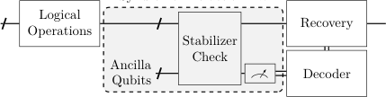
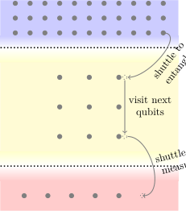
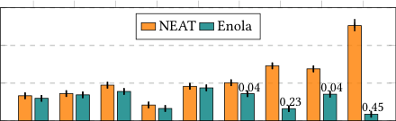
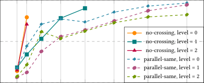

# gdc-neat

<!-- page 1 -->

NEAT: A Neutral-Atom Transpiler for Joint Mapping and

Scheduling of Syndrome Extraction Circuits

Dingchao Gao*, Kai Zhang*, Sanjiang Li, Shenggang Ying, Fangming Liu, Jianxin Chen

Abstract

1
Introduction

Quantum Error Correction (QEC) demands efficient implementa-
tion of syndrome extraction circuits. However, existing compilers
for neutral-atom processors largely miss the opportunity to co-
optimize these circuits by exploiting both the structural proper-
ties of Quantum Error-Correcting Codes (QECCs) and the physical
constraints of neutral-atom architectures. In this work, we intro-
duce NEAT, an SMT-based compiler that jointly optimizes qubit
mapping and syndrome extraction scheduling for a broad class of
stabilizer-based QECCs, achieving depth-optimal execution with
minimal shuttling overhead on neutral-atom platforms. Across a
wide range of QECCs, NEAT consistently achieves near-optimal
circuit depth and reduces atom movement by 3×–30× compared
the baseline compiler Enola. Logical-level simulations further demon-
strate 2×–20× lower logical error rates under realistic hardware
noise. A hierarchical symmetry-breaking formulation and relaxed
parallel-motion constraints substantially improve solver scalabil-
ity, yielding up to 100× speedup in compilation time. Together,
these results show that NEAT produces depth-optimal, movement-
efficient, and logically robust syndrome extraction schedules, while
scaling effectively to large QECCs on neutral-atom hardware.

Quantum computing promises to revolutionize information pro-
cessing by exploiting superposition and entanglement to achieve
exponential or polynomial speedups for specific tasks [14, 28, 34].
However, the inherently fragile qubits make quantum computers
susceptible to noise and decoherence [19]. To go beyond Noisy
Intermediate-Scale Quantum (NISQ) and achieve reliable com-
putation, Quantum Error Correction (QEC) encodes logical qubits
into redundant physical qubits using Quantum Error-Correcting
Codes (QECCs) and repeatedly performs syndrome extraction to
detect and correct errors [13, 33], allowing logical operations with
high fidelity. As illustrated in Fig. 1, a QEC workflow involves mul-
tiple rounds of syndrome extraction, decoding, and recovery (or up-
dating the Pauli frame [6, 20, 29]). During this process, syndrome
extraction circuits are particularly critical, as their fidelity and
efficiency directly determine the reliability and overall through-
put of fault-tolerant quantum computation, especially for neutral-
atom platforms where each QEC cycle operates at the millisecond
timescale [1, 2].

## Syndrome Extraction ×n

## Data
Qubits

## Logical
Operations

## Recovery

CCS Concepts

## Stabilizer

## Check

## Ancilla

• Hardware →Quantum error correction and fault tolerance.

## Decoder

## Qubits

Keywords

*Figure 1: Workflow of quantum error correction. Ancilla
qubits are entangled with data qubits via a syndrome extrac-
tion circuit to measure the eigenvalues of stabilizer genera-
tors. The resulting syndromes are post-processed by the clas-
sical decoders to guide recovery operations, thereby preserv-
ing the logical information.*

Quantum Error Correction, Neutral-Atom Quantum Computing,
SMT-based Compilation

ACM Reference Format:
Dingchao Gao*, Kai Zhang*, Sanjiang Li, Shenggang Ying, Fangming Liu,
Jianxin Chen. 2026. NEAT: A Neutral-Atom Transpiler for Joint Mapping
and Scheduling of Syndrome Extraction Circuits. In 63rd ACM/IEEE De-
sign Automation Conference (DAC ’26), July 26–29, 2026, Long Beach, CA,
USA. ACM, New York, NY, USA, 7 pages. https://doi.org/10.1145/3770743.
3804083

## Implementing QEC inevitably incurs substantial resource over-
head, as each logical qubit requires many physical qubits [11, 25].
Among competing platforms, such as superconducting [8] and ion-
trap [15], neutral-atom quantum computing (NAQC) offers a
uniquely scalable path forward due to its high qubit density and
reconfigurable geometry. These features in NAQC—large system
size, reconfigurable connectivity, and long-range interactions—are
particularly advantageous for implementing QECCs [11, 25], many
of which are difficult or impossible to realize on fixed-connectivity
superconducting or ion-trap devices.

* Dingchao Gao and Kai Zhang contributed equally to this work. Dingchao Gao and
Shenggang Ying are with the Key Laboratory of System Software (Chinese Acad-
emy of Sciences) and the State Key Laboratory of Computer Science, Institute of
Software, Chinese Academy of Sciences. Kai Zhang and Jianxin Chen are with the
Department of Computer Science and Technology, Tsinghua University. Kai Zhang
is also with Pengcheng Laboratory. Fangming Liu is with Pengcheng Laboratory
and Huazhong University of Science and Technology. Sanjiang Li is with the Cen-
tre for Quantum Software and Information, University of Technology Sydney. For
inquiries, please contact: Dingchao Gao (gaodc@ios.ac.cn) and Kai Zhang (zhang-
k23@mails.tsinghua.edu.cn).

## However, existing quantum compilers, originally developed for
NISQ-era superconducting or ion-trap circuits [18, 35], neglect key
NAQC constraints—such as shuttling-induced errors, Rydberg block-
ade radius, and laser scheduling conflicts—limiting their applica-
bility to large-scale atomic processors. Meanwhile, existing NAQC
compilers targeting NISQ-level circuits [17, 23, 37, 40] assume a
fixed gate schedule and focus on locality or transport distance. As
a result, they overlook the unique structure of syndrome extraction

This work is licensed under a Creative Commons Attribution 4.0 International License.
DAC ’26, Long Beach, CA, USA
© 2026 Copyright held by the owner/author(s).
ACM ISBN 979-8-4007-2254-7/2026/07
https://doi.org/10.1145/3770743.3804083

<!-- page 2 -->

DAC ’26, July 26–29, 2026, Long Beach, CA, USA
Dingchao Gao*, Kai Zhang*, Sanjiang Li, Shenggang Ying, Fangming Liu, Jianxin Chen

circuits and cannot fully exploit their commutativity and schedul-
ing flexibility.

qubits via CX or CZ gates. The circuit depth directly affects relia-
bility, as deeper circuits accumulate more noise, leading to higher
logical error rates. Optimizing these circuits is therefore essential
for implementing QECCs on practical hardware such as neutral-
atom processors.

To bridge these gaps, we introduce NEAT (Neutral-Atom Tran-
spiler), an SMT-based compiler that jointly optimizes mapping
and syndrome-extraction scheduling. Compared to prior SMT-based
QEC schedulers [26, 41], which assume fixed qubit placements and
ignore transport, NEAT explicitly models atomic motion and motion-
safety predicates within the same SMT formulation as logical com-
mutation. In contrast to existing NAQC compilers [17, 23, 37], which
treat the schedule as a fixed input, NEAT co-designs the qubit move-
ment and gate order. NEAT is, to our knowledge, the first frame-
work that jointly optimizes neutral-atom mapping and gate sched-
uling in a single symbolic model tailored to neutral-atom architec-
tures. In summary, our contributions are as follows:

2.2
Neutral-Atom Quantum Computing

## By trapping individual atoms in arrays of optical tweezers or op-
tical lattices, current neutral-atom processors realize thousands of
movable qubits with long coherence times and high-fidelity Ryd-
berg gates [1, 2, 7, 10, 24]. At the same time, emerging zone-based
architectures support continuous qubit reloading and mid-circuit
correction, further enhancing scalability and robustness [1, 2, 7].

## Example 1 (SyndRome extRaction in a zoned aRchitectuRe).
A particularly promising layout for fault-tolerant quantum comput-
ing is the zoned architecture, which spatially separates different
functional regions of the processor [1, 2], as illustrated in Fig. 2a.
The syndrome extraction process on such a neutral-atom platform,
as shown in Fig. 1, proceeds as follows:

• Joint mapping and scheduling optimization. We formu-
late the syndrome extraction compilation problem on neutral-
atom platforms as a joint spatiotemporal optimization prob-
lem and encode it as a compact SMT model that achieves
depth-optimal scheduling while naturally enforcing Rydberg-
interaction and motion-safety constraints.
• End-to-end logical evaluation. We develop an end-to-end
logical-level evaluation framework for benchmarking logical-
level fidelity in QEC scenarios, in contrast to the circuit-
level fidelity metric used in previous NAQC compilers.
• Scalable SMT formulation. We combine a multi-level symmetry-
breaking formulation with relaxed parallel-motion constraints
to eliminate redundant solutions and substantially improve
the compiler’s scalability.

## • Data qubits: Before syndrome extraction, data qubits are held
in the entanglement zone, where they await interaction with
ancilla qubits.
• Ancilla qubits: Ancilla qubits are cooled and initialized in
the preparation zone, then shuttled to the entanglement zone
to interact with data qubits. After the stabilizer checks, they
are transported to the measurement zone for readout.

## zone
prepare zone
entangle zone

Extensive evaluations show that NEAT consistently achieves
near-optimal circuit depths and reduced atomic movement over-
head, leading to improved logical fidelity and demonstrating its po-
tential as a hardware-aware QEC compiler for neutral-atom quan-
tum processors. All code and data are available in the author’s
GitHub repository .1

## shuttle to

## entangle

## visit next

## (b) AOD-based atom transfer

## qubits

## Rydberg
radius R

## shuttle to

## measure

## measurement

2
Background

In this section, we briefly review the fundamentals of QECC and
neutral-atom architectures that underlie our proposed framework.

## ≤R
> R

## (a) Schematic of zone architecture

## (c) Rydberg two-qubit gate

2.1
Quantum Error-Correcting Code
A QECC that uses 𝑛physical qubits to encode 𝑘logical qubits with
a code distance 𝑑is denoted as an [[𝑛, 𝑘, 𝑑]] code. For a code on
𝑛qubits with 𝑚stabilizer checks, the parity-check matrix 𝐻∈
{0, 1}𝑚×2𝑛, represented in binary symplectic form (BSF), is a binary

*Figure 2: Neutral-atom zone architecture and basic atom op-
erations.*

## During syndrome extraction in NAQC architectures, two primary
sources of error must be considered: shuttling errors and two-
qubit gate errors. Shuttling errors arise from atom transport and
can be mitigated through improved qubit mapping, while two-qubit
gate errors are exacerbated by repeated global Rydberg excitation
and therefore decrease with shallower schedules.

matrix where each row specifies the 𝑋and 𝑍components of a
stabilizer. In this representation, each row of 𝐻corresponds to a
Pauli operator described by two binary vectors—one for its 𝑋com-
ponents and one for its 𝑍components. Two such Pauli operators
commute if and only if their symplectic inner product equals zero
over 𝔽2. This leads directly to the symplectic self-orthogonality
of the parity-check matrix:

## To transfer atoms between different trapping sites, modern neutral-
atom processors use acousto-optic deflectors (AODs) to shuttle
atoms between regions [7]. This enables flexible and reconfigurable
qubit arrangements. Such shuttling can be parallelized when the
transport trajectories do not intersect, minimizing the overall trans-
fer time, as illustrated in Fig. 2b. Following [17], we say that two
qubit moves 𝑒𝑖∶(𝑥𝑖, 𝑦𝑖) →(𝑥′

𝐻𝑋(𝐻𝑍)T = 0
(mod 2).
(1)

The stabilizer check is implemented by the syndrome extraction
circuit. In practice, this involves entangling data qubits with ancilla

## 𝑖, 𝑦′

## 𝑖) and 𝑒𝑗∶(𝑥𝑗, 𝑦𝑗) →(𝑥′

## 𝑗, 𝑦′

## 𝑗) are
parallel-legal if and only if

## (𝑥𝑖⋆𝑥𝑗) ⟺(𝑥′

## 𝑖⋆𝑥′

## 𝑗)
and
(𝑦𝑖⋆𝑦𝑗) ⟺(𝑦′

## 𝑖⋆𝑦′

## 𝑗)
(2)

1https://github.com/gcc-bug/neat/

<!-- page 3 -->

NEAT: A Neutral-Atom Transpiler for Joint Mapping and Scheduling of Syndrome Extraction Circuits
DAC ’26, July 26–29, 2026, Long Beach, CA, USA

## employ coloration-based grouping for CSS codes to identify par-
allelizable stabilizers while it is still far from optimal. More re-
cent SMT-based approaches such as Peham et al. [26] and QECC-
Synth [41] begin to capture broader inter-stabilizer commutativity
and achieve depth-optimal scheduling with fixed-qubit placements.

(x′

j, y′

## (x′

## j, y′

(x′

i, y′

j)

(x′

i, y′

## j)

i)

## i)

## 



## (xj, yj)

(xi, yi)

## 3.2
Movement-Induced Constraints on NAQC

(xj, yj)

(xi, yi)

## In neutral-atom architectures, logical operations are constrained
not only by circuit topology but also by the physical transport of
atoms. Atoms are moved between different locations using AODs
and optical traps, as illustrated in Fig. 2b. During transport, idle
qubits accumulate decoherence, and the motion process itself in-
troduces additional latency and spatially dependent errors.

(a) valid non-crossing moves

## (b) invalid crossing moves

*Figure 3: Examples of parallel atomic movements.*

## for all ⋆∈{<, =, >}. Intuitively, this condition preserves the rela-
tive ordering of atoms along both axes and forbids crossing trajec-
tories.

## Existing NAQC compilers, including ZAC [23], Enola [37], and
DasAtom [17], consider locality or minimize transport distance
but assume a fixed gate order. In particular, Enola also offers coloration-
based scheduling, but the internal ancilla visitation order remains
fixed by construction. Ignoring commutativity during movement
optimization forfeits major opportunities to reduce both circuit
depth and total shuttling.

## Example 2 (PaRallel movement with paRallel-legal). It is
important to note that two movements being parallel does not neces-
sarily imply they can be executed concurrently. Fig. 3 illustrates two
such cases with red arrows. In Fig. 3a, two parallel moves are valid
since their relative ordering is preserved. In contrast, the configura-
tion in Fig. 3b is invalid because the moves violate the monotonic
ordering condition:

## 𝑦𝑖< 𝑦𝑗, but 𝑦′

## 𝑖= 𝑦′

## 𝑗
(3)

## Example 3 (Manual TRajectoRy Design foR the SuRface Code).
In superconducting architectures, a standard syndrome extraction sched-
ule of the surface code [9] achieves depth 4. We can also manually
design ancilla trajectories on a neutral-atom array as in Fig. 4 that
use only three movement operations. However, under the same total
distance, many equally short mappings fail to reach depth 4 due to
transport conflicts.

## In neutral-atom processors, two-qubit gates exploit the Rydberg
blockade mechanism [10, 22], where atoms excited to high-lying
Rydberg states interact strongly within a blockade radius 𝑅. When
two atoms lie within this range, excitation of one inhibits excita-
tion of the other, enabling conditional gate operations, as shown
in Fig. 2c. This spatial constraint directly limits which qubits can
interact simultaneously and thus influences gate scheduling and
circuit layout decisions.

## x1

## Collectively, these architectural and operational advances posi-
tion neutral-atom platforms as leading candidates for scalable, con-
tinuously operated, fault-tolerant quantum processors.

## x1

## x1

## q2

## q5

## q8

## q2

## q5

## q8

## q2

## q5

## q8

## x3

## z1

## z3

## z1

## z3
x3

## z1

## x3

## q1

## q4

## q7

## q1

## q4

## q7

## q1

## q4

## q7

## z0

## x0

## z2

## x0

## z2

## z0

## x0

## z2

## q0

## q3

## q6

## q0

## q3

## q6

## q0

## q3

## q6

## 3
Problem Statement

## x2

## x2

## x2

## Efficient compilation of syndrome extraction circuits is essential
for realizing fault-tolerant quantum computation, especially on neutral-
atom platforms where shuttling and Rydberg-interaction constraints
strongly couple logical scheduling with physical motion. Unlike
fixed-qubit architectures, neutral-atom execution requires deter-
mining both the schedule of two-qubit gates and the physical move-
ment of ancilla atoms. These two subproblems are tightly inter-
dependent: the schedule determines ancilla trajectories, while fea-
sible trajectories restrict which gates can be executed in parallel.
This coupling makes syndrome extraction a fundamentally joint
spatiotemporal optimization problem.

## (a) Move 1

## (b) Move 2

## (c) Move 3

*Figure 4: Manual ancilla trajectories for a surface-code sta-
bilizer that together realize a depth-4 syndrome extraction
using only three movement operations and a total transport
distance of 2 + √2 grid units.*

## Therefore, neither scheduling nor mapping can be optimized in
isolation. Only a joint optimization—reasoning over gate ordering,
atom placement, and multi-stage movement simultaneously—can
produce hardware-feasible and fidelity-maximizing syndrome ex-
traction circuits.

## 3.1
Commutativity in Stabilizer Measurements

## Stabilizer measurements admit rich commutation structure. Two-
qubit entangling gates acting on different ancilla–data pairs of-
ten commute, and even gates across different stabilizers can be
reordered when they overlap on an even number of qubits. Exploit-
ing this flexibility is crucial for minimizing circuit depth.

## In this work, we formalize these challenges and present a sys-
tematic approach that jointly optimizes both mapping and sched-
uling. Our objective can be formally stated as follows:

## Problem: Given a parity-check matrix 𝐻, find a schedule
of Rydberg excitations, trap transfers, and shuttling opera-
tions that realizes the stabilizer checks on a neutral-atom
architecture with high fidelity, while satisfying NAQC hard-
ware constraints (e.g., the parallel-legal-move constraint).

## Most existing compilers leverage only local commutativity. Frame-
works such as Qiskit [18] and TKet [35] apply peephole rewrites
and as-soon-as-possible (ASAP) scheduling. Tremblay et al. [38]

<!-- page 4 -->

DAC ’26, July 26–29, 2026, Long Beach, CA, USA
Dingchao Gao*, Kai Zhang*, Sanjiang Li, Shenggang Ying, Fangming Liu, Jianxin Chen

4
Proposed Solution

## (C2) Temporal exclusivity. Each qubit and ancilla can participate
in at most one two-qubit gate per layer:

We formulate the joint mapping and scheduling problem as a sat-
isfiability modulo theory (SMT) model that unifies logical com-
mutation and physical motion within a single symbolic reason-
ing framework. This enables simultaneous optimization of the syn-
drome extraction order and atom transport while ensuring Rydberg-
safe parallelism.

## ∀𝑞≠𝑞′ ∶𝐻(⋆)

## 𝑐,𝑞= 𝐻(⋆)

## 𝑐,𝑞′ = 1 ⇒𝑇(⋆)

## 𝑐,𝑞≠𝑇(⋆)

## 𝑐,𝑞′,
(7)

## ∀𝑐≠𝑐′ ∶𝐻(⋆)

## 𝑐,𝑞= 𝐻(⋆)

## 𝑐′,𝑞= 1 ⇒𝑇(⋆)

## 𝑐,𝑞≠𝑇(⋆)

## 𝑐′,𝑞.
(8)

## (C3) Commutation parity. For overlapping 𝑋- and 𝑍-stabilizers
𝑎and 𝑏,

4.1
Symbolic Formulation

## 1[𝑇(𝑋)
𝑎,𝑞< 𝑇(𝑍)

## ∑
𝑞∈Ω𝑎,𝑏

## 𝑏,𝑞] ≡0
(mod 2),
(9)

Depth-optimal syndrome extraction requires each data qubit to
participate in every entangling layer, leaving no idle stages. On
neutral-atom hardware, transporting data qubits would introduce
excessive motional heating and decoherence. We therefore assume
that data qubits remain fixed after initialization, while ancilla qubits
are shuttled to their target data qubits via AOD-based transport. In
this setting, our goal is to jointly determine the static placement of
data qubits on physical traps and the dynamic shuttling trajecto-
ries of ancilla qubits throughout syndrome extraction.

## which preserves the global commutativity discussed in Section 3.1.

## (C4) Spatial–temporal linking. Whenever 𝑇(⋆)

## 𝑐,𝑞
= 𝑡, the ancilla
and data qubit must be co-located and the global laser active:

## 𝑇(⋆)

## 𝑐,𝑞= 𝑡⟺(𝑥(⋆)

## 𝑐,𝑡, 𝑦(⋆)

## 𝑐,𝑡) = (𝑥𝑞, 𝑦𝑞) ∧ℓ𝑡= 1.
(10)

## For alternative architectural assumptions, the co-location constraint
can be generalized as:

Each ancilla movement incurs heating before re-cooling, as il-
lustrated in Fig. 2b, making the number of movements the dom-
inant error source rather than the geometric travel distance. Ac-
cordingly, our formulation is designed so that, among depth-optimal
schedules, ancilla trajectories tend to have few movements in prac-
tice.

## 𝑇(⋆)

## 𝑐,𝑞= 𝑡⟺‖(𝑥(⋆)

## 𝑐,𝑡, 𝑦(⋆)

## 𝑐,𝑡) −(𝑥𝑞, 𝑦𝑞)‖2 ≤𝑅∧ℓ𝑡= 1.
(11)

## where 𝑅denotes the effective Rydberg interaction radius illustrated
in Fig. 2c.

## (C5) Spatial exclusivity. All data and ancilla qubits must occupy
unique grid sites:

The process proceeds in 𝑇discrete scheduling stages, each in-
cluding both ancilla transport and entangling operations. Given
the parity-check matrices 𝐻𝑋, 𝐻𝑍of the code and a bounded 2-D
grid representing the atom array, the SMT solver determines:

## ∀𝑞≠𝑞′ ∶(𝑥𝑞, 𝑦𝑞) ≠(𝑥𝑞′, 𝑦𝑞′),
(12)

## ∀𝑡, 𝑐≠𝑐′ ∶(𝑥(⋆)

## 𝑐,𝑡, 𝑦(⋆)

## 𝑐,𝑡) ≠(𝑥(⋆)

## 𝑐′,𝑡, 𝑦(⋆)

## 𝑐′,𝑡).
(13)

(1) data-qubit placement,
(2) trajectories of ancilla qubits across stages, and
(3) the stage index of each two-qubit gate.

## (C6) Motion safety: Let 𝑒𝑐,𝑡= ((𝑥(⋆)

## 𝑐,𝑡, 𝑦(⋆)

## 𝑐,𝑡), (𝑥(⋆)

## 𝑐,𝑡+1, 𝑦(⋆)

## 𝑐,𝑡+1)). Paral-
lel moves are allowed only if non-conflicting:

## Π(𝑒𝑐,𝑡, 𝑒𝑐′,𝑡) = 1 or at least one of the moves is static.
(14)

Index sets. We define 𝑡∈{0, … , 𝑇−1} (stages), 𝑞∈𝒬(data qubits),
𝑎∈𝒜𝑋, 𝑏∈𝒜𝑍, 𝑐∈𝒜= 𝒜𝑋∪𝒜𝑍, and grid coordinates (𝑥, 𝑦) ∈
[𝑥min, 𝑥max]×[𝑦min, 𝑦max]∩ℤ2.

## This enforces the hardware-aware safety condition: parallel atomic
movements are permitted only when geometrically non-conflicting
according to the parallel-legal move rule in Eq. 2. In this work, we
consider two choices of the predicate Π: (1) a strict “no-crossing”
rule derived directly from Eq. 2, and (2) a relaxed “parallel-same”
rule that permits parallel motion only when the two movement
vectors are identical (Fig. 3a). These two motion-safety predicates
primarily affect solver scalability, and we compare their impact in
Section 5.3.

Entries 𝐻𝑋𝑎,𝑞= 1 and 𝐻𝑍

𝑏,𝑞= 1 indicate ancilla–data interactions.
Shared data qubits between ancilla 𝑎, 𝑏are

Ω𝑎,𝑏= {𝑞∣𝐻𝑋
𝑎,𝑞= 𝐻𝑍

𝑏,𝑞= 1}.
(4)

Interaction times are encoded by 𝑇(𝑋)

## 𝑎,𝑞, 𝑇(𝑍)

## 𝑏,𝑞∈{−1, 0, … , 𝑇−1}, where
−1 means inactive. Each data qubit 𝑞has a fixed coordinate (𝑥𝑞, 𝑦𝑞),

## and each ancilla follows a trajectory (𝑥(⋆)

## 𝑐,𝑡, 𝑦(⋆)

## 𝑐,𝑡). A binary variable
ℓ𝑡∈{0, 1} marks activation of the global Rydberg laser at stage 𝑡;
when ℓ𝑡= 1, ancilla–data pairs within the blockade radius 𝑅exe-
cute two-qubit gates (see Fig. 2c).

## 4.3
Objective Function
The optimization goal is to minimize the total number of schedul-
ing stages:

## 𝑐,𝑞𝑇(⋆)

## 4.2
Constraints

## 𝑐,𝑞.
(15)

## min max

## The model constraints ensure logical correctness, temporal exclu-
sivity, and geometric feasibility.

## Minimizing the maximal interaction time reduces both the total
number of movement stages and the sequential two-qubit layers
required for full syndrome extraction, directly improving overall
execution fidelity. While we focus on 2-D neutral-atom arrays with
global Rydberg pulses, the constraints (C4)–(C6) can be adapted to
alternative architectures by modifying the interaction-radius and
motion-safety predicates.

## (C1) Check-matrix activation. Visitation variables are active only
when required by the parity-check matrices:

## 𝐻(⋆)

## 𝑐,𝑞= 0 ⟺𝑇(⋆)

## 𝑐,𝑞= −1,
(5)

## 𝐻(⋆)

## 𝑐,𝑞= 1 ⟺0 ≤𝑇(⋆)

## 𝑐,𝑞≤𝑇−1.
(6)

<!-- page 5 -->

NEAT: A Neutral-Atom Transpiler for Joint Mapping and Scheduling of Syndrome Extraction Circuits
DAC ’26, July 26–29, 2026, Long Beach, CA, USA

4.4
Symmetry Breaking

## 5.1
Performance Across QECCs

The symbolic formulation admits multiple equivalent solutions due

## As discussed in Section 3.2, Enola cannot produce depth-optimal
syndrome-extraction circuits. We therefore use NEAT-generated
schedules as inputs to Enola so that both compilers share the same
two-qubit interaction skeleton, yielding identical circuit depths and
enabling a fair comparison of movement overhead.

to spatial and temporal symmetries. In particular, if 𝒯= {𝑇(⋆)

𝑐,𝑞} is

a valid schedule, then the time-reversed schedule (𝑇−1) −𝑇(⋆)

𝑐,𝑞is
also valid; similarly, any spatial placement can be rotated or re-
flected within the dihedral group 𝐷4 without violating the con-
straints in (C1)–(C6). Exploring all such symmetric solutions se-
verely degrades solver performance.

## As shown in Table 2, NEAT reduces the number of movement
operations for Surface7 (58 →3) and for Surface13 (177 →3),
while shortening the total travel distance by factors of 3.0× and
6.9×, respectively. For Planar13, NEAT uses only 3 moves versus
292 for Enola, and the corresponding total distance drops by over
one order of magnitude (1580 vs. 11115 grid units). Even on other
small codes, NEAT consistently matches or improves upon Enola
in both movement count and total distance. Overall, these results
demonstrate that our joint spatial–temporal formulation consis-
tently produces motion-efficient schedules with near-optimal cir-
cuit depths that scale robustly across heterogeneous QECCs.

We therefore introduce two practical levels of symmetry-breaking
constraints [31]:

• Level 1 (sum-vector inequalities). Lightweight linear in-
equalities fix the temporal direction and select a representa-
tive spatial sector of the 𝐷4 orbit by constraining the aver-
age visitation time and the signed sums of (𝑥𝑞, 𝑦𝑞) around a
reference center.
• Level 2 (lexicographic order). A stronger form that en-
forces lexicographic minimality of the decision-variable vec-
tor under all temporal and spatial group operations, remov-
ing almost all symmetry-related ties at the cost of additional
constraints.
In practice, Level 1 already provides substantial speedups with mod-
est overhead, while Level 2 offers further improvements on the
largest instances. We compare both choices empirically in Section 5.3.

## 5.2
Logical-Level Fidelity Validation

## Prior NAQC compilers rely on analytic fidelity models that mul-
tiply per-gate and per-qubit noise factors. However, such fidelity
scores are ill-suited for QEC settings: these models penalize circuits
with more qubits and more gates, even though larger circuits usu-
ally correspond to higher-distance codes with substantially better
fault-tolerant behavior.

Overall, our solution encodes qubit placement, ancilla motion,
and stabilizer-interaction timing into a single SMT formulation
that unifies stabilizer commutation rules with hardware constraints
on NAQC. By minimizing the maximal interaction time and ap-
plying hierarchical symmetry breaking to remove redundant spa-
tial and temporal equivalents, the solver produces depth-optimal
schedules that, in all our benchmarks, also exhibit substantially
reduced ancilla movement compared to existing NAQC compilers.
This symbolic framework forms the basis of NEAT, a neutral-atom
transpiler that jointly handles mapping and syndrome extraction
scheduling for general QECCs.

## For instance, a NEAT-compiled 𝑑= 7 surface code receives an
estimated fidelity of ∼0.4 under such models, whereas a larger
𝑑= 13 surface code is assigned a fidelity below 0.05—yet the 𝑑=13
code achieves orders-of-magnitude lower logical error rate in prac-
tice. This discrepancy motivates using end-to-end logical-level sim-
ulation rather than analytic fidelity limited to the circuit level.

## To this end, we implement an end-to-end logical-level simulation
framework based on Stim [12] to evaluate the logical error rates.
Our simulations are based on the standard memory experiments [4,
9], including 𝑑rounds of syndrome extraction with circuit-level
noise parameters defined as in Table 1. The logical error rates (LER)
are illustrated in Fig. 5. Both NEAT and Enola circuits are evalu-
ated under the same circuit-level noise model and decoded with the
same decoder configuration (BP+OSD [30] or Pymatching [16]).

5
Evaluation

We evaluate NEAT using two complementary experiments. The
first measures end-to-end physical performance on representative
stabilizer codes. We assess the generality and scalability of NEAT,
using Enola [37] as a baseline because its problem formulation—
movement-aware scheduling on 2-D neutral-atom arrays—is the
closest to ours, enabling a fair and meaningful comparison. Table 1
lists the physical parameters used for movement-cost estimation
and Stim-based simulations. The second analyzes the scalability of
our compiler through an ablation study.
Table 1: Key parameters, where 𝑙represents the default spac-
ing (i.e., unit distance) in the SLM array, and 𝑎denotes the
acceleration of qubit movement. [37]

## 10−6

## Logical Error Rate

## NEAT
Enola

## 10−4

## 10−2

## 0.45
0.04
0.04
0.23

## 100

## C4

## C6

## Steane

## Shor

## 3DColor

## Surface7

## Surface13

## Planar13
Planar7

*Figure 5: Logical error rates of NEAT and Enola [37] com-
piled circuits under Stim-based noise simulation.*

## Across all tested code examples, NEAT achieves significantly
lower LER than Enola, with improvements of 2×–20× for surface
codes where movement-induced errors dominate error accumula-
tion and similarly large gains on planar codes. Importantly, NEAT
preserves the expected fault-tolerance trend: both Surface7 →
13 and Planar7 →13 exhibit clear LER reductions as distance in-
creases. Enola shows no such behavior—its 𝑑=13 surface and pla-
nar circuits even incur higher LER than their 𝑑=7 counterparts.

Parameter
𝑓2𝑞
𝑓trans
𝑇2
𝑇2q
𝑇trans
𝑙
𝑎
Value
99.5% 99.9% 1.5 s 360 ns 1.5 𝜇s 15 𝜇m 2750 m/s2

All optimization instances are solved using the CP-SAT backend
of OR-Tools [27] on a workstation equipped with eight Intel Xeon
Platinum 8253 CPUs (2.20 GHz, 256 threads) under 64-bit Linux.
All experiments are executed under a 2-hour timeout (7200 s).

<!-- page 6 -->

DAC ’26, July 26–29, 2026, Long Beach, CA, USA
Dingchao Gao*, Kai Zhang*, Sanjiang Li, Shenggang Ying, Fangming Liu, Jianxin Chen

*Table 2: Optimized circuit depth and motion metrics for representative QECCs. Distances are given in grid units.*

Code
Parameters
|Q|
#gate
#depth
NEAT
Enola [37]

device-agnostic
NEAT
#move
total distance
#move
total distance

𝐶4 [39]
[[4, 2, 2]]
6
8
4
5
4
8.0
11
17.899
𝐶6 [20]
[[6, 2, 2]]
10
16
4
4
4
17.656
8
29.656
Steane [36]
[[7, 1, 3]]
13
24
6
6
6
51.901
23
51.549
Shor [32]
[[9, 1, 3]]
17
24
6
6
5
37.142
19
48.892
3D Color [21]
[[8, 3, 2]]
13
24
8
8
7
54.422
27
56.507
Surface7 [3]
[[49, 1, 7]]
97
168
4
4
3
161.882
58
493.827
Surface13 [3]
[[289, 1, 13]]
337
624
4
4
3
568.587
177
3907.205
Planar7 [5]
[[85, 1, 7]]
169
312
4
4
3
355.829
100
1291.641
Planar13 [5]
[[313, 1, 13]]
625
1200
4
4
3
1580.122
292
11115.277

These results confirm that NEAT’s joint optimization of mapping
and scheduling reduces noise accumulation while maintaining the
correct logical-level scaling on neutral-atom hardware.

## and yield lower logical error rates under Stim-based simulations
compared to Enola.

## Although solving the SMT model remains time-consuming for
the largest instances, syndrome-extraction circuits are compiled of-
fline and reused across many QEC cycles and algorithmic runs. In
typical fault-tolerant settings where a fixed code and syndrome ex-
traction pattern are executed for millions of cycles, this one-time
compilation cost is amortized over long computations and becomes
negligible compared to the overall runtime.

5.3
Scalability Ablation

To quantify how each component of our formulation contributes
to solver scalability, we conduct an ablation on the surface code,
varying:

• Symmetry-breaking level: Level 0 (none), Level 1 (sum-
vector), and Level 2 (lexicographic).
• Motion-safety predicate: either “no-crossing” (derived from
Eq. 2) or “parallel-same” (movement vectors are strictly equal,
as in Fig. 3a).

## 6
Conclusions

## In this study, we present NEAT, a hardware-aware compiler that
formulates syndrome-extraction for a broad class of stabilizer-based
QECCs on 2-D neutral-atom architectures as a unified scheduling-
and-placement problem solved via SMT. By combining stabilizer
commutativity, Rydberg-safe parallelism, and motion-safety con-
straints within a search space with broken symmetries, NEAT jointly
optimizes mapping and scheduling, reducing both circuit depth
and ancilla motion. Across all tested codes, NEAT consistently finds
schedules that require substantially less atomic transport than state-
of-the-art baselines.

104

Solver time (s)

## no-crossing, level = 0
no-crossing, level = 1
no-crossing, level = 2
parallel-same, level = 0
parallel-same, level = 1
parallel-same, level = 2

102

3
5
7
9
11
13
15
17
100

## Future work includes extending the approach to larger-distance
codes through hierarchical or heuristic SMT formulations, explor-
ing the use of additional ancilla qubits to simplify extraction cir-
cuits, and integrating NEAT with continuous-operation and mid-
circuit-recycling architectures to support scalable fault-tolerant neutral-
atom computation.

Code distance 𝑑

*Figure 6: Solver runtime for surface codes under different
configuration settings. Missing points indicate failure to
reach depth 4 within the 7200 s timeout.*

## All configurations target the known minimum depth 4 for surface-
code syndrome extraction, as in Fig. 4.

*Fig. 6 shows the solver runtime scaling with code distances. Across
all settings, Level 0 is always the slowest, while Level 1 reduces run-
time by up to 62× (no-crossing) or about one order of magnitude
(parallel-same). Level 2 adds only minor benefit and mainly helps
on the largest parallel-same instances. For any symmetry level,
parallel-same is typically 3–11× faster than no-crossing. Combin-
ing Level 1 with parallel-same yields the best overall performance
and, at 𝑑=5, gives nearly two orders of magnitude improvement
over the no-crossing, Level 0 baseline. Meanwhile, Level 2 with
parallel-same is the only setting that reaches 𝑑=17.*

## Acknowledgment

## This work was supported by the Quantum Science and Technology–
National Science and Technology Major Project under Grant No.
2024ZD0300502, Beijing Nova Program Grant No.20240484652, the
National Natural Science Foundation of China under Grant No.
12471437, the National Key Research and Development Program of
China under Grant No. 2023YFA1009403, the National Natural Sci-
ence Foundation of China under Grant No. 12347104, the Beijing
Natural Science Foundation under Grant No. Z220002, the Major
Key Project of PCL under Grant Nos. PCL2025A10 and PCL2024A06,
and the Shenzhen Science and Technology Program under Grant
No. RCJC20231211085918010.

## Overall, our evaluation shows that NEAT effectively unifies sym-
bolic reasoning with neutral-atom hardware constraints. The SMT
formulation, combined with hierarchical symmetry breaking, scales
to realistic QEC codes and reduces solver runtime, while preserv-
ing depth optimality and motion safety. At the physical level, NEAT’s
movement-aware schedules substantially reduce atomic transport

## The authors thank Rui Han from the Key Laboratory of System
Software, Chinese Academy of Sciences, for helpful discussions
and insightful suggestions on the SMT solver.

<!-- page 7 -->

NEAT: A Neutral-Atom Transpiler for Joint Mapping and Scheduling of Syndrome Extraction Circuits
DAC ’26, July 26–29, 2026, Long Beach, CA, USA

References

## [27] Laurent Perron and Frédéric Didier. 2025. CP-SAT. Google. https://developers.

## google.com/optimization/cp/cp_solver/
[28] John Preskill. 2018. Quantum computing in the NISQ era and beyond. Quantum

[1] Dolev Bluvstein, Simon J Evered, Alexandra A Geim, Sophie H Li, Hengyun

Zhou, Tom Manovitz, Sepehr Ebadi, Madelyn Cain, Marcin Kalinowski, Dominik
Hangleiter, et al. 2024. Logical quantum processor based on reconfigurable atom
arrays. Nature 626, 7997 (2024), 58–65.
[2] Dolev Bluvstein, Alexandra A Geim, Sophie H Li, Simon J Evered, J Pablo

## 2 (2018), 79.
[29] Leon Riesebos, Xiang Fu, Savvas Varsamopoulos, Carmen G Almudever, and

## Koen Bertels. 2017. Pauli frames for quantum computer architectures. In Pro-
ceedings of the 54th Annual Design Automation Conference 2017. 1–6. doi:10.1145/
3061639.3062300
[30] Joschka Roffe, David R. White, Simon Burton, and Earl Campbell. 2020. De-

Bonilla Ataides, Gefen Baranes, Andi Gu, Tom Manovitz, Muqing Xu, Marcin
Kalinowski, et al. 2025. A fault-tolerant neutral-atom architecture for universal
quantum computation. Nature (2025), 1–3.
[3] H. Bombin and M. A. Martin-Delgado. 2007. Optimal resources for topological

## coding across the quantum low-density parity-check code landscape. Physical
Review Research 2, 4 (Dec 2020). doi:10.1103/physrevresearch.2.043423
[31] Francesca Rossi, Peter Van Beek, and Toby Walsh. 2006. Handbook of constraint

two-dimensional stabilizer codes: Comparative study. Phys. Rev. A 76 (Jul 2007),
012305. Issue 1. doi:10.1103/PhysRevA.76.012305
[4] Sergey Bravyi, Andrew W Cross, Jay M Gambetta, Dmitri Maslov, Patrick Rall,

## programming. Elsevier.
[32] Peter W Shor. 1995. Scheme for reducing decoherence in quantum computer

and Theodore J Yoder. 2024. High-threshold and low-overhead fault-tolerant
quantum memory. Nature 627, 8005 (2024), 778–782.
[5] Sergey B Bravyi and A Yu Kitaev. 1998. Quantum codes on a lattice with bound-

## memory. Physical review A 52, 4 (1995), R2493.
[33] Peter W Shor. 1996. Fault-tolerant quantum computation. In Proceedings of 37th

## conference on foundations of computer science. IEEE, 56–65.
[34] Peter W Shor. 1999. Polynomial-time algorithms for prime factorization and

ary. arXiv preprint quant-ph/9811052 (1998).
[6] Christopher Chamberland, Pavithran Iyer, and David Poulin. 2018.
Fault-
tolerant quantum computing in the Pauli or Clifford frame with slow error di-
agnostics. Quantum 2 (2018), 43. doi:10.22331/q-2018-01-04-43
[7] Neng-Chun Chiu, Elias C Trapp, Jinen Guo, Mohamed H Abobeih, Luke M Stew-

## discrete logarithms on a quantum computer. SIAM review 41, 2 (1999), 303–332.
[35] Seyon Sivarajah, Silas Dilkes, Alexander Cowtan, Will Simmons, Alec Edging-

## ton, and Ross Duncan. 2020. t| ket>: a retargetable compiler for NISQ devices.
Quantum Science and Technology 6, 1 (2020), 014003.
[36] Andrew Steane. 1996. Multiple-particle interference and quantum error correc-

art, Simon Hollerith, Pavel L Stroganov, Marcin Kalinowski, Alexandra A Geim,
Simon J Evered, et al. 2025. Continuous operation of a coherent 3,000-qubit
system. Nature (2025), 1–3.
[8] John Clarke and Frank K Wilhelm. 2008. Superconducting quantum bits. Nature

## tion. Proceedings of the Royal Society of London. Series A: Mathematical, Physical
and Engineering Sciences 452, 1954 (1996), 2551–2577.
[37] Daniel Bochen Tan, Wan-Hsuan Lin, and Jason Cong. 2025. Compilation for

453, 7198 (2008), 1031–1042.
[9] Eric Dennis, Alexei Kitaev, Andrew Landahl, and John Preskill. 2002. Topological

## dynamically field-programmable qubit arrays with efficient and provably near-
optimal scheduling. In Proceedings of the 30th Asia and South Pacific Design Au-
tomation Conference. 921–929.
[38] Maxime A Tremblay, Nicolas Delfosse, and Michael E Beverland. 2022. Constant-

quantum memory. J. Math. Phys. 43, 9 (Sept. 2002), 4452–4505. doi:10.1063/1.
1499754
[10] Simon J Evered, Dolev Bluvstein, Marcin Kalinowski, Sepehr Ebadi, Tom

## overhead quantum error correction with thin planar connectivity. Physical Re-
view Letters 129, 5 (2022), 050504.
[39] Lev Vaidman, Lior Goldenberg, and Stephen Wiesner. 1996. Error prevention

Manovitz, Hengyun Zhou, Sophie H Li, Alexandra A Geim, Tout T Wang, Nishad
Maskara, et al. 2023. High-fidelity parallel entangling gates on a neutral-atom
quantum computer. Nature 622, 7982 (2023), 268–272.
[11] Austin G Fowler, Matteo Mariantoni, John M Martinis, and Andrew N Cleland.

## scheme with four particles. Physical Review A 54, 3 (1996), R1745.
[40] Hanrui Wang, Daniel Bochen Tan, Pengyu Liu, Yilian Liu, Jiaqi Gu, Jason Cong,

2012. Surface codes: Towards practical large-scale quantum computation. Phys-
ical Review A—Atomic, Molecular, and Optical Physics 86, 3 (2012), 032324.
[12] Craig Gidney. 2021. Stim: a fast stabilizer circuit simulator. Quantum 5 (July

## and Song Han. 2024. Q-pilot: Field programmable qubit array compilation with
flying ancillas. In Proceedings of the 61st ACM/IEEE Design Automation Confer-
ence. 1–6.
[41] Keyi Yin, Hezi Zhang, Xiang Fang, Yunong Shi, Travis S Humble, Ang Li, and

2021), 497. doi:10.22331/q-2021-07-06-497
[13] Daniel Gottesman. 1997. Stabilizer codes and quantum error correction. California

## Yufei Ding. 2025. QECC-Synth: A Layout Synthesizer for Quantum Error Correc-
tion Codes on Sparse Architectures. In Proceedings of the 30th ACM International
Conference on Architectural Support for Programming Languages and Operating
Systems, Volume 1. 876–890.

## Institute of Technology.
[14] Lov K Grover. 1996. A fast quantum mechanical algorithm for database search. In

## Proceedings of the twenty-eighth annual ACM symposium on Theory of computing.
212–219.
[15] Hartmut Häffner, Christian F Roos, and Rainer Blatt. 2008. Quantum computing

## with trapped ions. Physics reports 469, 4 (2008), 155–203.
[16] Oscar Higgott and Craig Gidney. 2025. Sparse blossom: correcting a million

## errors per core second with minimum-weight matching. Quantum 9 (2025), 1600.
doi:10.22331/q-2025-01-20-1600
[17] Yunqi Huang, Dingchao Gao, Shenggang Ying, and Sanjiang Li. 2025. Dasatom:

## A divide-and-shuttle atom approach to quantum circuit transformation. IEEE
Transactions on Computer-Aided Design of Integrated Circuits and Systems (2025).
[18] Ali Javadi-Abhari, Matthew Treinish, Kevin Krsulich, Christopher J Wood, Jake

## Lishman, Julien Gacon, Simon Martiel, Paul D Nation, Lev S Bishop, An-
drew W Cross, et al. 2024. Quantum computing with Qiskit. arXiv preprint
arXiv:2405.08810 (2024).
[19] A Yu Kitaev. 1997. Quantum error correction with imperfect gates. In Quantum

## communication, computing, and measurement. Springer, 181–188.
[20] Emanuel Knill. 2005. Quantum computing with realistically noisy devices. Na-

## ture 434, 7029 (2005), 39–44. doi:10.1038/nature03350
[21] Aleksander Kubica, Beni Yoshida, and Fernando Pastawski. 2015. Unfolding the

## color code. New Journal of Physics 17, 8 (2015), 083026.
[22] Harry Levine, Alexander Keesling, Giulia Semeghini, Ahmed Omran, Tout T

## Wang, Sepehr Ebadi, Hannes Bernien, Markus Greiner, Vladan Vuletić, Hannes
Pichler, et al. 2019. Parallel implementation of high-fidelity multiqubit gates
with neutral atoms. Physical review letters 123, 17 (2019), 170503.
[23] Wan-Hsuan Lin, Daniel Bochen Tan, and Jason Cong. 2025. Reuse-aware compi-

## lation for zoned quantum architectures based on neutral atoms. In 2025 IEEE
International Symposium on High Performance Computer Architecture (HPCA).
IEEE, 127–142.
[24] Hannah J Manetsch, Gyohei Nomura, Elie Bataille, Xudong Lv, Kon H Leung,

## and Manuel Endres. 2025. A tweezer array with 6100 highly coherent atomic
qubits. Nature (2025), 1–3.
[25] Pavel Panteleev and Gleb Kalachev. 2021. Degenerate quantum LDPC codes with

## good finite length performance. Quantum 5 (2021), 585.
[26] Tom Peham, Ludwig Schmid, Lucas Berent, Markus Müller, and Robert Wille.

## 2025.
Automated Synthesis of Fault-Tolerant State Preparation Circuits for
Quantum Error-Correction Codes. PRX Quantum 6, 2 (2025), 020330.
