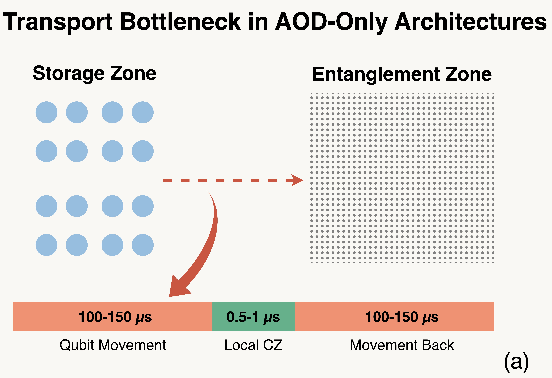

# 中性原子编译

## 背景

#### 1\. 中性原子架构与量子门 

- **底层控制硬件**：

    - SLM（空间光调制器）：用于长时间囚禁和存储量子比特。

    - AOD（声光偏转器）：光镊，搬运量子比特。

- **原生指令集**：编译流程针对硬件原生门集合 \{CZ,U3,measure\} 进行优化。

#### 2\. 双量子比特门的实现机制与噪声隐患 


- **物理机制**：双量子比特门依赖于**全局里德堡（Rydberg）激光**。激光将原子激发到高能级的里德堡态，利用“里德堡阻塞”效应，使得特定距离内的两个原子发生纠缠。

- **单区架构的致命缺陷**：在传统的**单区架构**中，里德堡激光会照射**整个**芯片区域。

- **主导噪声源：空闲比特激发**。即使某个量子比特当前不参与运算，只要它位于激光照射范围内，就会被误激发。

#### 3\. 分区架构（Zoned Architecture）


- **存储区（Storage Zone）**：

    - 用于存放当前不参与运算的量子比特。

    - 光镊间距较大（如 3μm），防止非预期的相互作用。

    - **核心优势**：该区域**完全屏蔽里德堡激光**，从根本上杜绝了空闲比特的激发错误，保护了量子态的相干性。

- **纠缠区（Entanglement Zone）**：

    - 专门用于执行双量子比特门的区域。

    - 光镊间距紧凑，以满足里德堡相互作用的物理距离要求。

    - 只有需要执行门的活跃比特才会被临时移入此区域。

- **读出区（Readout Zone）**：专门用于量子态测量。



- **移动开销**：原子转移和移动期间的退相干。

## 

#### 第一阶段：预处理（Preprocessing） 


**目标**：将高层量子电路适配到中性原子硬件的原生指令集。

1. **门集映射**：利用 Qiskit 等标准工具，将输入电路转换为硬件支持的 \{CZ,U3,measure\} 门集，并合并/优化单量子比特门。

2. **阶段划分（Staging）**：

    - 将电路中的双量子比特门（2Q gates）分配到不同的 **Rydberg 阶段**。

    - **约束**：同一个量子比特在同一个 Rydberg 阶段内不能参与多个门操作（避免冲突）。

    - **结果**：生成一系列并行的门组，组间存在依赖关系。这是后续布局的基础。

---

#### 第二阶段：布局（复用感知） 

这是 ZAC 最核心的创新模块，决定了量子比特的位置变化，直接影响搬运开销。**布局是逐阶段（Stage\-by\-Stage）动态调整的。**

##### 2\.1 初始布局（Initial Placement） layout


- **例子**：SWAP（q3, q4）编译成 CNOT（q3, q4） CNOT（q4, q3） CNOT（q3, q4）

- **方法**：采用**模拟退火（SA）** 优化所有量子比特在存储区的起始位置。

- **代价函数设计**：


    - 不再简单计算欧氏距离，而是估算**移动时长**。


    - **并行移动优化**：如果同一行上的多个比特需要移动到同一个里德堡位点，AOD 可以一次性拉伸将它们同时送达，代价取移动距离的最大值；否则需串行移动，代价取距离之和。（单AOD）

    - **权重机制**：越靠前的 Rydberg 阶段权重越高（因为初始位置估计更准确）。

    - **前瞻代价（Lookahead）**：在评估当前阶段移动代价时，会轻微考虑下一阶段的位置需求（α=0\.1），避免“捡了芝麻丢了西瓜”。

##### 2\.2 动态布局与复用策略（Dynamic Placement \& Reuse） 

对于每个后续的 Rydberg 阶段，ZAC 决定哪些比特留在纠缠区，哪些搬回存储区。


1. **识别可复用比特（Qubit Reuse Identification）**：

    - 如果一个比特在当前阶段使用了，且在下一个阶段还有门要执行，它就是“可复用的”。

    - **建模**：构建一个二分图，连接当前阶段的门与下一阶段的门。若当前门的某个比特能被下一阶段的门复用，则连边。

    - **求解**：使用 **Hopcroft\-Karp 算法**求最大匹配，以最大化复用数量。

    - **冲突解决**：如果一个里德堡位点上的两个比特都需要被复用（如图 6a），算法会强制其中一个搬回存储区，以避免下一阶段的操作冲突。

2. **门布局（Gate Placement）**：

    - 对于不可复用的门（即当前阶段执行完后，下一阶段不用的门），需要将它们放置到纠缠区的空余位点上。

    - **方法**：构建二分图（门 vs 候选位点），使用 **Jonker\-Volgenant 算法**求解最小权重的完美匹配，最小化总移动代价。

3. **非复用比特归位（Non\-Reuse Qubit Placement）**：

    - 对于那些在当前阶段执行完、且下一阶段暂时不用的比特，需要将它们搬回存储区。

    - **候选位置选择**：

        - 原始位置（保证可行性）。

        - 靠近当前纠缠区位点的位置（减少本次移动距离）。

        - 靠近其“伙伴比特”（如果下一阶段需要与某比特配对）的位置（减少未来移动距离）。

    - **方法**：同样使用最小权重完美匹配算法进行分配。

---

#### 第三阶段：多 AOD 负载均衡调度（Load\-Balancing Scheduling） 

**目标**：根据布局确定的位置变化，生成具体的机器指令，并最大化硬件利用率。

1. **生成重排作业（Rearrangement Jobs）**：

    - 基于布局结果，提取出所有需要的比特移动操作。

    - 利用最大独立集（MIS）算法，将无依赖关系的移动打包进同一个“重排作业”，确保作业内的移动可以由一个 AOD 并行完成。

2. **依赖分析**：


    - **位置依赖（Trap Dependency）**：两个不同的作业不能同时占用同一个 SLM 光镊陷阱。后一个作业的“放下”操作必须晚于前一个作业的“拾取”操作。

    - **比特依赖（Qubit Dependency）**：同一个量子比特的移动、单比特门和双比特门必须严格串行执行。

3. **多 AOD 负载均衡分配**：

    - **策略**：采用贪心算法，**优先将耗时最长的重排作业分配给最早空闲的 AOD**。

    - **原因**：长作业是流水线的瓶颈。优先安排长作业，短作业可以灵活填充空隙。

4. **时序确定**：计算每个作业的开始时间和结束时间，确保满足所有依赖约束。

5. **冲突：**


约束：**非交叉**（行列不交叉）、**保序**（同行列原子始终同行列）、**鬼点**（行列所有网格点受影响）；多个移动可并行为一个重排步骤，但约束限制并行性。

现有编译器布局阶段仅优化移动距离，忽略重排约束，导致后续路由需更多串行重排步骤。因此需**布局阶段联合优化路由可行性**。\(就是优化路由\)


## ZAP

#### （1）ASAP 调度（Scheduling）：

**目标**：划分逻辑阶段（Stages），确定双量子比特门和单量子比特门的执行时机，最小化不必要的原子搬运。

- **策略选择：ASAP\-Separate（分离调度）**


    - ZAP 放弃了传统的 **ASAP\-Joint（联合调度）**。在 Joint 模式下，单双门混合在同一阶段，虽然逻辑深度浅，但会导致频繁的原子进出纠缠区（例如刚搬回存储区又要搬回来）。

    - **Separate 模式**：

        1. **第一步**：优先将所有**双量子比特门**分配到尽可能早的逻辑阶段（Rydberg Stages）。

        2. **第二步**：将**单量子比特门**填充到双量子比特门执行后的空闲时间槽中。

    - **效果**：显著减少了跨区搬运的次数，虽然逻辑深度略有增加，但物理执行时间（Makespan）反而缩短。

#### （2）门放置（Placement）

- **核心：阶段性放置（Stage\-wise Placement）**

    1. **空闲比特管理（Idle\-Qubit Management）**：

        - **问题**：当前阶段不需要参与运算，但下一阶段还需要用的比特，是留在充满激光的纠缠区（省去搬运但面临串扰），还是搬回安全的存储区（增加搬运但避免串扰）？


    2. **活跃双门放置（Active Two\-Qubit Placement）**：

        - 对于当前阶段需要执行的 CZ 门，尝试将比特移动到纠缠区的特定位点上。


        - **优化**：如果一对比特已经占据了纠缠对中的一个位置，优先将另一个比特移动到配对的另一个位置。

        - **冲突避免**：在选择目标位置时，使用 **Routing\-Aware Score**（公式 17），优先选择移动距离短且未来 AOD 移动路径冲突少的位置。

#### （3）门路由（Routing）

- **并行移动与死锁破解**：

    - **贪心 MIS**：选取兼容性图中的最大独立集作为一批次进行并行移动。


    - **停车位移（Parking Shift）**：当检测到路径冲突（如图 5 示例）时，ZAP 不会简单地串行化等待，而是插入一个微小的辅助位移（Parking），暂时错开冲突路径，随后再进行并行移动。


# 2025\-iccad\-Routing\-Aware\-Placement for Zoned Neutral Atom\-based Quantum Computing

## 问题背景与动机 （多AOD）


约束：**非交叉**（行列不交叉）、**保序**（同行列原子始终同行列）、**鬼点**（行列所有网格点受影响）；多个移动可并行为一个重排步骤，但约束限制并行性。

现有编译器布局阶段仅优化移动距离，忽略重排约束，导致后续路由需更多串行重排步骤。因此需**布局阶段联合优化路由可行性**。\(就是优化路由\)


## 方法核心框架：路由感知布局 

位置选择问题建模为搜索树！


## 搜索空间与A\*算法求解 

布局的搜索空间极大（如16原子返回存储区有3616≈1024种可能），采用*A算法*\*引导高效搜索，将布局问题编码为状态空间搜索：

- **状态定义**：节点表示部分布局（从“无原子放置”的开始节点，到“全放置”的目标节点），继承前驱节点的布局并新增1个原子/门的放置（门布局按“门\-by\-门”，中间布局按“原子\-by\-原子”）。

- **成本函数（实际成本\+前瞻成本）**：

- 最终成本为g∗\(p\)=cost\(p\)\+∑复用原子前瞻成本\+α⋅∑已经放置原子/门平均前瞻成本。

- **启发函数（三部分组合）**：

    1. **可容部分**：假设剩余移动均加入现有组，用未放置原子到最近空闲陷阱的最小距离下界，计算成本增量下界：h\(p\):=maxGdmax\(G\)−maxadmin\(a\)；

    2. **加速部分**：用现有兼容组的行列映射二叉树的**键值差标准差**估计冲突概率（标准差越小，间距越一致，冲突越少）

    3. **前瞻部分**：加入未放置原子/门的平均前瞻成本，恢复加速效果。


## 已经做了的工作

#### （0）

```YAML
(py12) D:\zwq\Physics-Layer-Compiler\Fable5_coded_compiler>python examples/compare_zac.py
ZAC config: qasm_sa_1000_reuse   (cost model: ZAC simulator)
circuit            q     ZAC us    Fable us   ratio   ZAC fid  Fable fid   mv  pulse  1qS
-----------------------------------------------------------------------------------------
bv_n14            14     2790.8      3708.0    1.33    0.8572     0.8471   27     13   14
bv_n19            19     3975.4      5553.3    1.40    0.7977     0.7784   37     18   19
bv_n30            30     4096.1      5425.9    1.32    0.7729     0.7470   37     18   19
bv_n70            70     9132.4     11349.2    1.24    0.4517     0.4081   73     36   37
cat_n22           22     4619.8      5594.0    1.21    0.7621     0.7512   42     21   22
cat_n35           35     8208.3     10386.4    1.27    0.5949     0.5652   69     34   35
ghz_n23           23     4759.6      6062.7    1.27    0.7509     0.7360   45     22   23
ghz_n40           40     9656.3     12186.9    1.26    0.5309     0.4960   78     39   40
ghz_n78           78    17986.1     24277.9    1.35    0.1833     0.1342  154     77   78
ising_n42         42     3181.4      2659.3    0.84    0.4566     0.4663   23      6    5
ising_n98         98     3386.7     30703.6    9.07    0.1553     0.0105  243     12    5
knn_n31           31    16516.0     18813.6    1.14    0.2512     0.2512  141     78   64
multiply_n13      13     7361.5      6386.3    0.87    0.6486     0.6574   63     25   22
qft_n18           18    20512.6     13676.7    0.67    0.0813     0.1096  122     66   67
qft_n29           29    46256.9     30876.7    0.67    0.0011     0.0025  260    110  111
seca_n11          11    11315.3     12771.5    1.13    0.4458     0.4251  129     43   37
swap_test_n25     25    14207.2     14360.5    1.01    0.3424     0.3553  114     63   52
wstate_n27        27     8189.0     14384.9    1.76    0.5219     0.4484  127     28   29
-----------------------------------------------------------------------------------------
n 18 geomean Fable/ZAC time ratio 1.264   mean fidelity ZAC 0.4781 Fable 0.4550
worst ratios: ising_n98 9.07x, wstate_n27 1.76x, bv_n19 1.40x, ghz_n78 1.35x, bv_n14 1.33x
```

#### 

#### （1）一些处理

##### 1，线路2q分批次

**思想**

ASAP Scheduling优化2q门shots，寻求2q门最大并行

**效果**

##### 2，线路限制分批次

**思想**

现在批次处理，后面不好分chunk

##### 3，不调回

**效果**

```YAML
(py12) D:\zwq\Physics-Layer-Compiler\Fable5_coded_compiler>python examples/compare_zac.py   
ZAC config: qasm_sa_1000_reuse   (cost model: ZAC simulator)
circuit            q     ZAC us    Fable us   ratio   ZAC fid  Fable fid   mv  pulse  1qS
-----------------------------------------------------------------------------------------
bv_n14            14     2790.8      3732.0    1.34    0.8572     0.8486   26     13   14
bv_n19            19     3975.4      5584.4    1.40    0.7977     0.7796   36     18   19
bv_n30            30     4096.1      5329.9    1.30    0.7729     0.7514   35     18   19
bv_n70            70     9132.4     11514.9    1.26    0.4517     0.4057   72     36   37
cat_n22           22     4619.8      5912.3    1.28    0.7621     0.7477   43     21   22
cat_n35           35     8208.3     10590.5    1.29    0.5949     0.5625   69     34   35
ghz_n23           23     4759.6      6247.7    1.31    0.7509     0.7339   45     22   23
ghz_n40           40     9656.3     12570.5    1.30    0.5309     0.4909   79     39   40
ghz_n78           78    17986.1     24904.9    1.38    0.1833     0.1298  155     77   78
ising_n42         42     3181.4      1528.0    0.48    0.4566     0.4938   11      6    7
ising_n98         98     3386.7      4421.0    1.31    0.1553     0.1580   34     12   13
knn_n31           31    16516.0     18528.1    1.12    0.2512     0.2548  137     78   64
multiply_n13      13     7361.5      6224.4    0.85    0.6486     0.6649   57     25   22
qft_n18           18    20512.6     13860.4    0.68    0.0813     0.1098  120     66   67
qft_n29           29    46256.9     31429.9    0.68    0.0011     0.0025  260    110  111
seca_n11          11    11315.3     13276.1    1.17    0.4458     0.4286  124     43   37
swap_test_n25     25    14207.2     14121.6    0.99    0.3424     0.3596  110     63   52
wstate_n27        27     8189.0     14337.6    1.75    0.5219     0.4514  124     28   29
-----------------------------------------------------------------------------------------
n 18 geomean Fable/ZAC time ratio 1.112   mean fidelity ZAC 0.4781 Fable 0.4652
worst ratios: wstate_n27 1.75x, bv_n19 1.40x, ghz_n78 1.38x, bv_n14 1.34x, ghz_n23 1.31x
```

#### （2）MOVE复杂度优化

构建冲突图和依赖关系：

- 代码里对每一对 move 做一次可行性判断，双重循环是 O\(n^2\)。

- DAG 的祖先传播/冲突扩展：

    - 这里会把依赖关系沿着 DAG 往前展开，最坏情况下会访问很多边，所以会达到 O\(n^3\)。

- 组件合并、着色和拓扑排序：

    - 组件图上的 DSATUR 风格着色和拓扑排序通常是 O\(n^2\) 级别，整体不会超过上面的主导项。

所以结论是：

- 最坏情况复杂度：O\(n^3\)

- 如果冲突图比较稀疏、依赖关系不密集，实际更接近：O\(n^2\)

**效果**

时间是原来的47%

```YAML
(py12) D:\zwq\Physics-Layer-Compiler\Fable5_coded_compiler>python examples\fable_fidelity.py
compiler      circuit            q   runtime   stg       time     fidelity   moves   mvB     2q  pulse    par
-------------------------------------------------------------------------------------------------------------
compiler      bv_n14            14     0.016    67     1073.0     0.796185      27    26     13     13   1.00
compiler_zwq  bv_n14            14     0.005    67     1073.0     0.796185      27    26     13     13   1.00
compiler      bv_n19            19     0.009    92     1568.0      0.72516      37    36     18     18   1.00
compiler_zwq  bv_n19            19     0.008    92     1568.0      0.72516      37    36     18     18   1.00
compiler      bv_n30            30     0.008    73     1408.0     0.857072      36    35     18     18   1.00
compiler_zwq  bv_n30            30     0.006    73     1408.0     0.857072      36    35     18     18   1.00
compiler      bv_n70            70     0.020   183     3207.8     0.332774      73    72     36     36   1.00
compiler_zwq  bv_n70            70     0.011   183     3207.8     0.332774      73    72     36     36   1.00
compiler      cat_n22           22     0.009   109     1740.9     0.686032      44    43     21     21   1.00
compiler_zwq  cat_n22           22     0.009   109     1740.9     0.686032      44    43     21     21   1.00
compiler      cat_n35           35     0.017   174     2996.7     0.531471      70    69     34     34   1.00
compiler_zwq  cat_n35           35     0.009   174     2996.7     0.531471      70    69     34     34   1.00
compiler      ghz_n23           23     0.011   114     1832.1     0.673269      46    45     22     22   1.00
compiler_zwq  ghz_n23           23     0.010   114     1832.1     0.673269      46    45     22     22   1.00
compiler      ghz_n40           40     0.018   199     3523.2     0.478421      80    79     39     39   1.00
compiler_zwq  ghz_n40           40     0.016   199     3523.2     0.478421      80    79     39     39   1.00
compiler      ghz_n78           78     0.048   389     6942.2     0.197641     156   155     77     77   1.00
compiler_zwq  ghz_n78           78     0.016   389     6942.2     0.197641     156   155     77     77   1.00
compiler      ising_n42         42     0.154    28      435.0     0.392212     105    11     82      6  13.67
compiler_zwq  ising_n42         42     0.087    29      469.4     0.391835     105    12     82      6  13.67
compiler      ising_n98         98     0.696    71     1352.5     0.106985     249    34    194     12  16.17
compiler_zwq  ising_n98         98     0.533    94     2192.4     0.101266     249    57    194     12  16.17
compiler      knn_n31           31     0.080   281     5267.6     0.435089     166   137    120     78   1.54
compiler_zwq  knn_n31           31     0.041   279     5199.6     0.435703     166   135    120     78   1.54
compiler      multiply_n13      13     0.013   105     1989.3     0.774749      69    57     40     25   1.60
compiler_zwq  multiply_n13      13     0.011   105     1989.3     0.774749      69    57     40     25   1.60
compiler      qft_n18           18     0.071   254     4191.2     0.159181     193   120    306     66   4.64
compiler_zwq  qft_n18           18     0.047   242     3799.2     0.159934     193   108    306     66   4.64
compiler      qft_n29           29     0.325   507     9540.5   0.00546851     498   257    812    110   7.38
compiler_zwq  qft_n29           29     0.176   492     9050.5   0.00552086     498   242    812    110   7.38
compiler      seca_n11          11     0.024   206     4340.8     0.586336     150   124     84     43   1.95
compiler_zwq  seca_n11          11     0.018   206     4340.8     0.586336     150   124     84     43   1.95
compiler      swap_test_n25     25     0.064   227     4094.4     0.522526     133   110     96     63   1.52
compiler_zwq  swap_test_n25     25     0.028   225     4026.4      0.52312     133   108     96     63   1.52
compiler      wstate_n27        27     0.031   182     4566.7      0.66672     125   124     52     28   1.86
compiler_zwq  wstate_n27        27     0.018   181     4532.7     0.667129     125   123     52     28   1.86
-------------------------------------------------------------------------------------------------------------
compiler      AVERAGE         34.7     0.090 181.2     3337.2     0.495961   125.4  85.2  114.7   39.4   3.30
compiler      TOTAL_MOVE_STAGES1534
compiler_zwq  AVERAGE         34.7     0.043 180.7     3327.3     0.495757   125.4  84.8  114.7   39.4   3.30
compiler_zwq  TOTAL_MOVE_STAGES1526
```

#### （3）2q放置优化

**思想**

采用了“交换位置”“邻居位置”作为邻居解点

评价函数改成了 最大链 \+ 冲突边 加权

**效果**

```Python
population_size: int = 6,
    iterations: int = 8,
    neighbors_per_solution: int = 2,
    neighbor_sample_size: int = 24,
```

```YAML
(py12) D:\zwq\Physics-Layer-Compiler\Fable5_coded_compiler>python examples\compare_zac.py   
ZAC config: qasm_sa_1000_reuse   (cost model: ZAC simulator)
compiler        circuit            q     ZAC us    Fable us   ratio   ZAC fid  Fable fid   mv  pulse  1qS
---------------------------------------------------------------------------------------------------------
compiler        bv_n14            14     2790.8      3732.0    1.34    0.8572     0.8486   26     13   14
compiler_search bv_n14            14     2790.8      3510.7    1.26    0.8572     0.8304   38     13   14
compiler        bv_n19            19     3975.4      5584.4    1.40    0.7977     0.7796   36     18   19
compiler_search bv_n19            19     3975.4      4854.8    1.22    0.7977     0.7608   53     18   19
compiler        bv_n30            30     4096.1      5329.9    1.30    0.7729     0.7514   35     18   19
compiler_search bv_n30            30     4096.1      3950.2    0.96    0.7729     0.7725   34     18   19
compiler        bv_n70            70     9132.4     11514.9    1.26    0.4517     0.4057   72     36   37
compiler_search bv_n70            70     9132.4     11564.1    1.27    0.4517     0.3777  107     36   37
compiler        cat_n22           22     4619.8      5912.3    1.28    0.7621     0.7477   43     21   22
compiler_search cat_n22           22     4619.8      5912.3    1.28    0.7621     0.7477   43     21   22
compiler        cat_n35           35     8208.3     10590.5    1.29    0.5949     0.5625   69     34   35
compiler_search cat_n35           35     8208.3     10590.5    1.29    0.5949     0.5625   69     34   35
compiler        ghz_n23           23     4759.6      6247.7    1.31    0.7509     0.7339   45     22   23
compiler_search ghz_n23           23     4759.6      6247.7    1.31    0.7509     0.7339   45     22   23
compiler        ghz_n40           40     9656.3     12570.5    1.30    0.5309     0.4909   79     39   40
compiler_search ghz_n40           40     9656.3     12570.5    1.30    0.5309     0.4909   79     39   40
compiler        ghz_n78           78    17986.1     24904.9    1.38    0.1833     0.1298  155     77   78
compiler_search ghz_n78           78    17986.1     24897.7    1.38    0.1833     0.1293  155     77   78
compiler        ising_n42         42     3181.4      1528.0    0.48    0.4566     0.4938   11      6    7
compiler_search ising_n42         42     3181.4      1528.0    0.48    0.4566     0.4938   11      6    7
compiler        ising_n98         98     3386.7      4421.0    1.31    0.1553     0.1580   34     12   13
compiler_search ising_n98         98     3386.7      4421.0    1.31    0.1553     0.1580   34     12   13
compiler        knn_n31           31    16516.0     18528.1    1.12    0.2512     0.2548  137     78   64
compiler_search knn_n31           31    16516.0      9160.5    0.55    0.2512     0.3482   78     78   64
compiler        multiply_n13      13     7361.5      6224.4    0.85    0.6486     0.6649   57     25   22
compiler_search multiply_n13      13     7361.5      4943.4    0.67    0.6486     0.6995   40     25   22
compiler        qft_n18           18    20512.6     13860.4    0.68    0.0813     0.1098  120     66   67
compiler_search qft_n18           18    20512.6     15094.3    0.74    0.0813     0.1096  130     66   67
compiler        qft_n29           29    46256.9     31182.7    0.67    0.0011     0.0025  257    110  111
compiler_search qft_n29           29    46256.9     27281.4    0.59    0.0011     0.0027  249    110  111
compiler        seca_n11          11    11315.3     13276.1    1.17    0.4458     0.4286  124     43   37
compiler_search seca_n11          11    11315.3      8589.7    0.76    0.4458     0.4968   75     43   37
compiler        swap_test_n25     25    14207.2     14121.6    0.99    0.3424     0.3596  110     63   52
compiler_search swap_test_n25     25    14207.2      7443.2    0.52    0.3424     0.4416   63     63   52
compiler        wstate_n27        27     8189.0     14337.6    1.75    0.5219     0.4514  124     28   29
compiler_search wstate_n27        27     8189.0      8784.4    1.07    0.5219     0.5394   78     28   29
---------------------------------------------------------------------------------------------------------
compiler: n 18 geomean Fable/ZAC time ratio 1.111   mean fidelity ZAC 0.4781 Fable 0.4652
worst ratios: wstate_n27 1.75x, bv_n19 1.40x, ghz_n78 1.38x, bv_n14 1.34x, ghz_n23 1.31x
compiler_search: n 18 geomean Fable/ZAC time ratio 0.938   mean fidelity ZAC 0.4781 Fable 0.4831
worst ratios: ghz_n78 1.38x, ghz_n23 1.31x, ising_n98 1.31x, ghz_n40 1.30x, cat_n35 1.29x
```

**优化时间**


```YAML
节点存储 冲突图 DAG图
子节点更新改变的

32.038  优化到 7.224 
```


#### （4）线路优化

**思想**

QISQIT优化线路

**效果**

```YAML
(py12) D:\zwq\Physics-Layer-Compiler\Fable5_coded_compiler>python examples\compare_zac.py
ZAC config: qasm_sa_1000_reuse   (cost model: ZAC simulator)
compiler        circuit            q     ZAC us    Fable us   ratio   ZAC fid  Fable fid   mv  pulse  1qS
---------------------------------------------------------------------------------------------------------
compiler        bv_n14            14     2790.8      3732.0    1.34    0.8572     0.8511   26     13   14
compiler_search bv_n14            14     2790.8      3510.7    1.26    0.8572     0.8328   38     13   14
compiler        bv_n19            19     3975.4      5584.4    1.40    0.7977     0.7829   36     18   19
compiler_search bv_n19            19     3975.4      4854.8    1.22    0.7977     0.7640   53     18   19
compiler        bv_n30            30     4096.1      5329.9    1.30    0.7729     0.7568   35     18   19
compiler_search bv_n30            30     4096.1      3950.2    0.96    0.7729     0.7781   34     18   19
compiler        bv_n70            70     9132.4     11514.9    1.26    0.4517     0.4094   72     36   37
compiler_search bv_n70            70     9132.4     11564.1    1.27    0.4517     0.3811  107     36   37
compiler        cat_n22           22     4619.8      5912.3    1.28    0.7621     0.7475   43     21   22
compiler_search cat_n22           22     4619.8      5782.9    1.25    0.7621     0.7460   44     21   22
compiler        cat_n35           35     8208.3     10590.5    1.29    0.5949     0.5624   69     34   35
compiler_search cat_n35           35     8208.3     10347.0    1.26    0.5949     0.5633   70     34   35
compiler        ghz_n23           23     4759.6      6247.7    1.31    0.7509     0.7337   45     22   23
compiler_search ghz_n23           23     4759.6      6108.7    1.28    0.7509     0.7324   46     22   23
compiler        ghz_n40           40     9656.3     12570.5    1.30    0.5309     0.4908   79     39   40
compiler_search ghz_n40           40     9656.3     12288.6    1.27    0.5309     0.4926   80     39   40
compiler        ghz_n78           78    17986.1     24904.9    1.38    0.1833     0.1298  155     77   78
compiler_search ghz_n78           78    17986.1     24349.3    1.35    0.1833     0.1326  156     77   78
compiler        ising_n42         42     3181.4      1528.0    0.48    0.4566     0.4937   11      6    7
compiler_search ising_n42         42     3181.4      1528.0    0.48    0.4566     0.4937   11      6    7
compiler        ising_n98         98     3386.7      4421.0    1.31    0.1553     0.1559   34     12   13
compiler_search ising_n98         98     3386.7      4421.0    1.31    0.1553     0.1559   34     12   13
compiler        knn_n31           31    16516.0     18609.4    1.13    0.2512     0.2753  137     77   64
compiler_search knn_n31           31    16516.0      9161.3    0.55    0.2512     0.3769   78     77   64
compiler        multiply_n13      13     7361.5      6412.9    0.87    0.6486     0.6644   58     23   24
compiler_search multiply_n13      13     7361.5      5368.3    0.73    0.6486     0.6893   48     23   24
compiler        qft_n18           18    20512.6     14290.0    0.70    0.0813     0.1202  130     66   67
compiler_search qft_n18           18    20512.6     15546.4    0.76    0.0813     0.1195  132     66   67
compiler        qft_n29           29    46256.9     27675.2    0.60    0.0011     0.0110  241    110  111
compiler_search qft_n29           29    46256.9     30372.8    0.66    0.0011     0.0105  278    110  111
compiler        seca_n11          11    11315.3     13689.1    1.21    0.4458     0.4447  129     37   36
compiler_search seca_n11          11    11315.3      7805.7    0.69    0.4458     0.5129   66     37   36
compiler        swap_test_n25     25    14207.2     14198.4    1.00    0.3424     0.3826  110     62   52
compiler_search swap_test_n25     25    14207.2      7444.0    0.52    0.3424     0.4704   63     62   52
compiler        wstate_n27        27     8189.0     14337.6    1.75    0.5219     0.4509  124     28   29
compiler_search wstate_n27        27     8189.0      8784.4    1.07    0.5219     0.5388   78     28   29
---------------------------------------------------------------------------------------------------------
compiler: n 18 geomean Fable/ZAC time ratio 1.110   mean fidelity ZAC 0.4781 Fable 0.4702
worst ratios: wstate_n27 1.75x, bv_n19 1.40x, ghz_n78 1.38x, bv_n14 1.34x, ghz_n23 1.31x
compiler_search: n 18 geomean Fable/ZAC time ratio 0.939   mean fidelity ZAC 0.4781 Fable 0.4884
worst ratios: ghz_n78 1.35x, ising_n98 1.31x, ghz_n23 1.28x, ghz_n40 1.27x, bv_n70 1.27x
```

